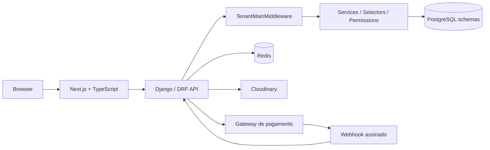
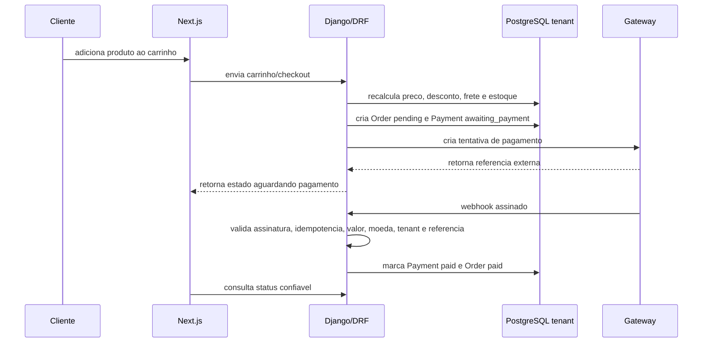

# Visao Geral - SaaS Multi-Tenant de Vendas/E-commerce

Este conjunto de documentos define uma referencia arquitetural para um futuro SaaS de vendas/e-commerce criado do zero.

O objetivo e iniciar o projeto ja com multi-tenancy, seguranca, pagamentos, operacao, testes e hardening como parte da arquitetura base.

## Navegacao

- [01 - Backend](01-BACKEND.md)
- [02 - Frontend Next.js](02-FRONTEND_NEXTJS.md)
- [03 - Multi-Tenant](03-MULTI_TENANT.md)
- [04 - Database](04-DATABASE.md)
- [05 - API Guidelines](05-API_GUIDELINES.md)
- [06 - Pagamentos e Webhooks](06-PAGAMENTOS_WEBHOOKS.md)
- [07 - Cloudinary e Imagens](07-CLOUDINARY_IMAGENS.md)
- [08 - Seguranca](08-SEGURANCA.md)
- [09 - Testes](09-TESTES.md)
- [10 - Deploy e Infra](10-DEPLOY_INFRA.md)
- [11 - Observabilidade](11-OBSERVABILIDADE.md)
- [12 - Roadmap](12-ROADMAP.md)
- [13 - Checklists](13-CHECKLISTS.md)
- [14 - Threat Model](14-THREAT_MODEL.md)
- [15 - Custos e Escalabilidade](15-CUSTOS_ESCALABILIDADE.md)
- [16 - Atores, Clientes e Identidades](16-ATORES_CLIENTES.md)
- [17 - Isolamento por Host e Autenticacao](17-ISOLAMENTO_HOST_AUTH.md)
- [18 - Checkout e Pagamentos por Tenant](18-CHECKOUT_PAGAMENTOS_POR_TENANT.md)
- [19 - Estoque e Concorrencia](19-ESTOQUE_CONCORRENCIA.md)
- [20 - Cancelamentos, Reembolsos e Chargeback](20-CANCELAMENTOS_REEMBOLSOS_CHARGEBACK.md)
- [21 - Fiscal](21-FISCAL.md)
- [22 - Suporte da Plataforma](22-SUPORTE_PLATAFORMA.md)
- [23 - SEO e Catalogo](23-SEO_CATALOGO.md)
- [24 - Dominios](24-DOMINIOS.md)
- [25 - Internacionalizacao](25-INTERNACIONALIZACAO.md)
- [26 - Soft Delete e Retencao](26-SOFT_DELETE_RETENCAO.md)
- [27 - Disaster Recovery](27-DISASTER_RECOVERY.md)
- [28 - Logs, Auditoria e Retencao](28-LOGS_AUDITORIA_RETENCAO.md)
- [29 - Uploads, Anexos e Documentos](29-UPLOADS_DOCUMENTOS.md)
- [30 - Feature Flags](30-FEATURE_FLAGS.md)
- [31 - Evolucao Arquitetural](31-EVOLUCAO_ARQUITETURAL.md)
- [32 - Checklist Final de Arquitetura](32-CHECKLIST_FINAL_ARQUITETURA.md)
- [33 - Webhook Routing e Secret Management](33-WEBHOOK_ROUTING_SECRET_MANAGEMENT.md)
- [34 - State Machines Canonicas](34-STATE_MACHINES_CANONICAS.md)
- [35 - Tenant Lifecycle](35-TENANT_LIFECYCLE.md)
- [36 - Entitlements, Planos e Limites](36-ENTITLEMENTS_PLANOS_LIMITES.md)
- [ADR](ADR/)

## Produto

O produto e uma plataforma SaaS onde cada empresa cliente cria e opera uma loja propria.

Cada loja podera:

- cadastrar produtos;
- organizar categorias;
- gerenciar imagens;
- controlar estoque;
- receber pedidos;
- processar pagamentos;
- acompanhar entregas;
- exportar dados;
- visualizar relatorios;
- administrar usuarios internos.

## Separacao de Responsabilidades

Existem mundos separados:

- Plataforma: operacao global do SaaS, tenants, dominios, planos, billing do SaaS, suporte e configuracoes globais.
- Tenant/loja: produtos, clientes finais, carrinhos, pedidos, pagamentos, imagens, estoque e relatorios da loja.
- Cliente final/comprador: pessoa que compra dentro de uma loja, sempre como registro do tenant.
- Visitante anonimo: pessoa sem login, com carrinho/sessao restritos ao Host atual.

O operador da plataforma nao e administrador da loja. O administrador da loja nao e operador da plataforma.

Cliente da plataforma e a empresa/loja que usa o SaaS. Cliente final e o comprador da loja. Eles nao devem compartilhar model, permissao ou sessao.

## Decisoes Principais

- Backend-first.
- Django + Django REST Framework.
- PostgreSQL.
- `django-tenants`.
- Um schema PostgreSQL por tenant.
- Tenant identificado exclusivamente por Host.
- Next.js + TypeScript no frontend.
- Cloudinary para imagens de produtos.
- Gateway externo para Pix/cartao.
- Webhooks assinados e idempotentes.
- Backups e exports tenant-scoped.
- OpenAPI como contrato de API.
- Customer tenant-scoped, sem conta global de comprador por padrao.
- Host-only authentication: cada subdominio possui autenticacao, sessao, cookies, CSRF, cache e contexto de seguranca independentes.
- Checkout e pagamento configuraveis por tenant, com validacao backend e credenciais tenant-scoped.
- Webhook routing com registry minimo no `public` e segredos protegidos.
- State machines canonicas para Order, Payment, Refund, Chargeback e estoque.
- Estoque com reserva transacional para evitar overselling.
- Cancelamentos, reembolsos e chargebacks auditados.
- Tenant lifecycle explicito.
- Suporte da plataforma com menor privilegio.
- Dominios customizados e HTTPS como evolucao futura segura.
- Soft delete/retencao para entidades sensiveis.
- Entitlements separados de feature flags e permissoes.
- Evolucao arquitetural progressiva, sem complexidade prematura.
- Hardening antes de producao.

## Visao Geral da Arquitetura

## Fluxo Base de Venda

## Principios

- O frontend nunca decide pagamento aprovado.
- Webhook falso nunca deve alterar pedido.
- Todo dado operacional vive no schema do tenant.
- Todo ID e interpretado dentro do schema ativo.
- Jobs, cache, sessoes, commands, exports e backups devem carregar tenant/schema.
- Fluxos sensiveis devem nascer seguros, nao provisoriamente inseguros.

## O Que Este Documento Nao E

- Nao e implementacao.
- Nao e contrato fechado de produto.
- Nao e copia do RH SaaS.
- Nao define biblioteca visual obrigatoria antes da fase de implementacao.
- Nao substitui auditoria de seguranca antes da producao.
