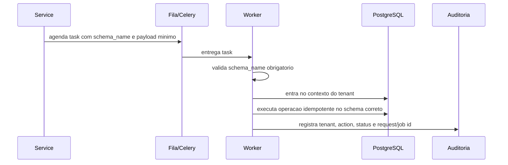
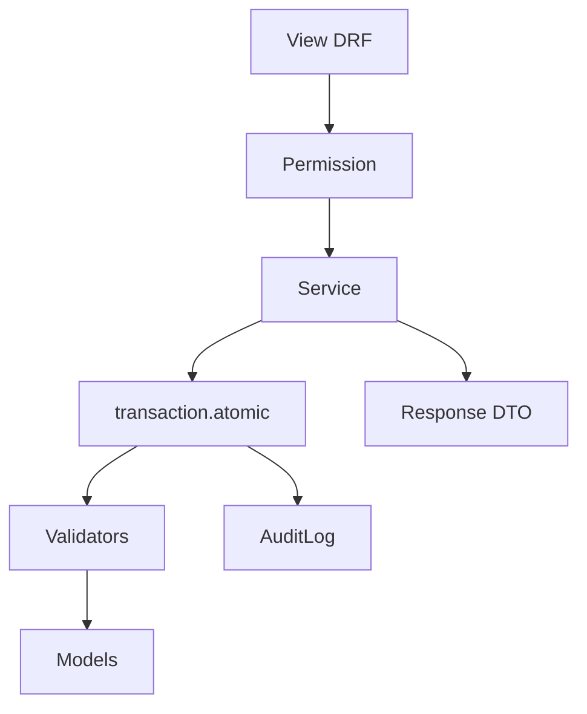

# Backend Architecture

O backend deve ser a fonte da verdade do SaaS.

Ele centraliza regras de negocio, permissoes, pagamentos, webhooks, validacoes, auditoria, jobs, commands, exports e integridade multi-tenant.

## Stack Recomendada

- Python.
- Django.
- Django REST Framework.
- PostgreSQL.
- `django-tenants`.
- Redis para cache, sessoes, throttling, locks e filas futuras.
- Celery ou alternativa equivalente para jobs assincronos.
- OpenAPI com `drf-spectacular`.

## Organizacao Recomendada

```text
apps/
  platform/
  tenancy/
  accounts/
  catalog/
  inventory/
  carts/
  orders/
  payments/
  shipping/
  coupons/
  audit/
```

Dentro de cada app:

```text
models.py
selectors.py
services.py
validators.py
permissions.py
serializers.py
views.py
tasks.py
signals.py
management/commands/
tests/
utils.py
```

## Camadas

### Models

Responsaveis por estrutura de dados, constraints, indices, relacionamentos e invariantes simples.

Devem evitar regra de fluxo complexa.

Exemplos adequados:

- constraints de unicidade;
- choices de status;
- propriedades simples;
- validacoes locais.

Anti-padroes:

- fazer chamada ao gateway no `save`;
- alterar pedido dentro do model de pagamento sem service;
- buscar tenant por parametro de usuario;
- misturar dados de plataforma e tenant.

### Selectors

Responsaveis por leitura.

Devem:

- retornar querysets ou DTOs de leitura;
- usar `select_related` e `prefetch_related`;
- ser tenant-scoped pelo schema ativo;
- nao alterar banco.

Anti-padroes:

- selector com efeito colateral;
- selector que usa schema global;
- selector que recebe `tenant_id` do frontend;
- selector que ignora permissoes quando o dado e sensivel.

### Services

Responsaveis por fluxos de escrita e regras transacionais.

Exemplos:

- criar pedido;
- reservar estoque;
- iniciar pagamento;
- processar webhook;
- cancelar pedido;
- emitir reembolso;
- aplicar cupom.

Devem:

- operar no schema ativo;
- recusar tenant vindo de query string, header customizado ou payload;
- usar `transaction.atomic` quando necessario;
- validar transicoes de estado;
- emitir auditoria;
- chamar selectors quando fizer sentido;
- nunca confiar no frontend para totais, status ou permissoes.

### Validators

Responsaveis por validacoes reutilizaveis.

Exemplos:

- validar estoque disponivel;
- validar cupom;
- validar payload de webhook;
- validar imagem e folder do Cloudinary;
- validar transicao de status.

### Permissions

Responsaveis por autorizacao.

Devem separar:

- operador da plataforma;
- administrador do tenant;
- papeis do tenant;
- cliente final.

Anti-padroes:

- usar `is_superuser` como permissao global e permissao de tenant ao mesmo tempo;
- deixar endpoint sensivel com `AllowAny` e checagem manual dispersa;
- permitir acao de plataforma no schema do tenant sem fluxo auditado.

### Serializers

Responsaveis por contrato de entrada e saida.

Devem:

- validar DTOs;
- expor campos seguros;
- impedir mass assignment;
- separar input e output serializers quando necessario;
- nao conter regra transacional pesada.

### Views

Responsaveis por HTTP.

Devem:

- autenticar;
- autorizar;
- chamar services/selectors;
- retornar response padronizada;
- nao implementar regra de negocio complexa diretamente.

### Tasks

Jobs assincronos devem receber `schema_name` explicitamente.

```text
process_payment_webhook(schema_name, event_id)
sync_gateway_payments(schema_name)
cleanup_product_images(schema_name)
expire_carts(schema_name)
```

Cada task deve entrar no contexto do tenant antes de acessar dados operacionais.

Fluxo seguro:



O que nao fazer:

- task descobrir tenant por parametro enviado pelo usuario;
- task acessar dado operacional antes de ativar schema;
- task reutilizar cache, arquivo temporario ou lock sem prefixo de tenant;
- task silenciosamente cair para `public` quando o schema for invalido.

### Cache, Throttling e Arquivos

Qualquer chave, lock, throttle, arquivo temporario, export ou backup ligado a tenant deve incluir `schema_name`.

Exemplos conceituais:

```text
cache:tenant:{schema_name}:cart:{session_id}
throttle:{schema_name}:{user_or_ip}:{endpoint}
exports/{schema_name}/{export_id}.csv
tmp/{schema_name}/{job_id}/
```

Nao usar chaves globais para carrinho, pedido, pagamento, sessao ou dado pessoal.

### Signals

Usar com cautela.

Permitido:

- auditoria simples;
- invalidacao controlada;
- bootstrap seguro dentro de tenant.

Evitar:

- fluxo de pagamento em signal;
- criacao de dados operacionais no `public`;
- chamadas externas em signal;
- regra critica invisivel.

### Management Commands

Classificar cada command:

- `tenant-only`;
- `platform-only`;
- `read-only`;
- `destructive`;
- `file-only`.

Commands tenant-only devem exigir schema explicito. Commands destrutivos devem exigir confirmacao, backup quando aplicavel e auditoria.

## Fluxo de Escrita Seguro



## Anti-Padroes Gerais

- Regra de negocio no frontend.
- Pagamento confirmado por retorno visual.
- Views gigantes.
- Services que ignoram schema ativo.
- Tasks sem schema.
- Commands operacionais rodando no `public`.
- Modelos operacionais no schema `public`.
- Exports globais.
- Cache sem tenant.
- Throttling sem schema.
- Arquivo temporario compartilhado entre tenants.
