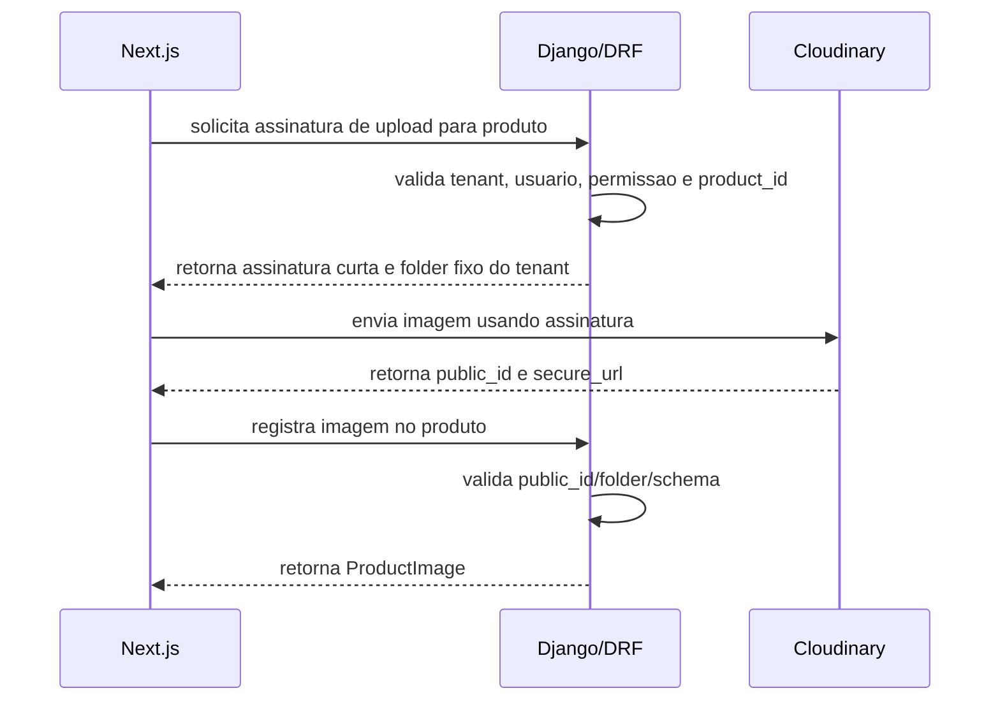

# Frontend Architecture - Next.js + TypeScript

O frontend recomendado e Next.js com TypeScript e React.

O frontend e responsavel por interface, navegacao, formularios, estado visual, consumo de API e experiencia do usuario. O backend continua sendo a fonte da verdade para regras sensiveis.

## Stack Recomendada

- Next.js.
- TypeScript.
- React.
- App Router.
- React Hook Form ou equivalente.
- Zod ou equivalente para validacao client-side.
- TanStack Query ou equivalente para cache client-side.
- Tailwind, shadcn/ui, Radix ou equivalentes para UI.
- Playwright para E2E.

Nenhuma biblioteca visual e obrigatoria antes da fase de implementacao.

## Estrutura Recomendada

```text
src/
  app/
  components/
  features/
  hooks/
  providers/
  services/
  lib/
  schemas/
  types/
  styles/
  tests/
```

## Responsabilidades

### app/

Rotas, layouts, loading states e error boundaries.

Exemplos:

- `/`
- `/products`
- `/cart`
- `/checkout`
- `/orders`
- `/admin/products`
- `/admin/orders`
- `/admin/payments`

### features/

Agrupa dominio funcional.

Exemplos:

- `features/products`
- `features/cart`
- `features/orders`
- `features/payments`
- `features/customers`
- `features/storefront`
- `features/admin`

Cada feature pode conter:

```text
components/
hooks/
services/
schemas/
types/
utils/
```

### components/

Componentes reutilizaveis e sem regra pesada.

### hooks/

Hooks compartilhados de UI, sessao, responsividade e comportamento.

### services/

Chamadas ao backend.

Devem usar um API client centralizado, com:

- `credentials: include` quando usar sessao/cookies;
- timeout;
- tratamento padronizado de erros;
- suporte a abort/cancelamento;
- headers CSRF quando necessario.

### schemas/

Validacoes client-side.

Validacao do frontend e apenas feedback rapido. A validacao definitiva e sempre no backend.

### types/

Tipos TypeScript derivados manualmente ou futuramente gerados a partir de OpenAPI.

## Autenticacao

Opcoes seguras:

- sessao Django com cookies seguros host-only;
- estrategia equivalente definida antes da implementacao.

Regras:

- cookie de uma loja nao autentica outra loja;
- cookies de sessao e CSRF nao usam `Domain=.meusaas.com`;
- rotas protegidas consultam sessao no backend;
- permissoes vem de endpoint confiavel;
- logout chama backend e limpa cache local;
- reset de senha e tenant-aware.

## Consumo da API

Padrao:

```text
UI -> Hook -> Service -> API client -> Django/DRF
```

O frontend nao deve:

- selecionar tenant por query string;
- selecionar tenant por header customizado;
- selecionar tenant por payload;
- recalcular valor final como fonte de verdade;
- confirmar pagamento;
- decidir permissao sozinho;
- aceitar imagem sem validacao do backend.

## Cache por Tenant

Chaves de cache client-side devem considerar:

- host;
- tenant;
- usuario;
- filtros relevantes.

Para dados sensiveis, o host atual e parte obrigatoria da chave. Carrinho, pedidos, pagamentos, perfil e sessao de `loja-a.meusaas.com` nao podem ser reaproveitados em `loja-b.meusaas.com`.

Dados sensiveis devem usar `no-store` ou invalidacao forte:

- sessao;
- carrinho;
- checkout;
- pedido;
- pagamento;
- dados pessoais;
- exports.

Catalogo publico pode usar cache controlado, desde que nao misture tenants.

## Cloudinary

Upload direto pelo frontend so e permitido com assinatura gerada pelo backend.

Fluxo:



O frontend nunca deve escolher livremente `folder` ou `public_id`.

## Checkout e Pagamentos

O frontend pode:

- iniciar checkout;
- exibir QR Code/Pix/campo de cartao;
- exibir opcoes de pagamento ativas retornadas pelo backend para o tenant;
- conduzir compra com login ou convidado conforme configuracao da loja;
- mostrar aguardando pagamento;
- consultar status no backend.

O frontend nao pode:

- decidir sozinho se a loja aceita convidado, login opcional ou pagamento manual;
- habilitar metodo de pagamento desativado no tenant;
- marcar pedido como pago;
- confiar no redirect do gateway como confirmacao final;
- processar webhook;
- alterar total sem recalculo do backend.

Configurar checkout por loja e pagamento por tenant e uma decisao backend-first. Ver [18 - Checkout e Pagamentos por Tenant](18-CHECKOUT_PAGAMENTOS_POR_TENANT.md).

## Tratamento de Erros

Erros devem ser padronizados:

- 400: payload invalido.
- 401: nao autenticado.
- 403: sem permissao.
- 404: recurso nao encontrado ou nao pertencente ao tenant.
- 409: conflito de estado.
- 422: regra de negocio invalida.
- 429: rate limit.
- 500: falha inesperada.

Mensagens devem ser amigaveis e nao vazar stack trace, secrets ou detalhes internos.

## Build, Lint e Typecheck

Comandos esperados:

- `lint`;
- `typecheck`;
- `test`;
- `test:e2e`;
- `build`;
- validacao de env;
- checagem de contrato OpenAPI, quando adotada.

## Referencia de Ferramentas

Um frontend Next.js existente foi analisado apenas como referencia de ferramentas e padroes. Foram considerados uteis:

- App Router;
- `features/`;
- `components/ui`;
- services por dominio;
- API client centralizado;
- CSRF antes de login/logout;
- cookies/sessao com `credentials: include`;
- tratamento de erro padronizado;
- Playwright;
- scripts de lint, typecheck, build e verificacoes.

Nao devem ser copiados: nomes, dominios, regras financeiras/RH, CSP antigo, rotas especificas, mocks especificos ou qualquer caminho local.
