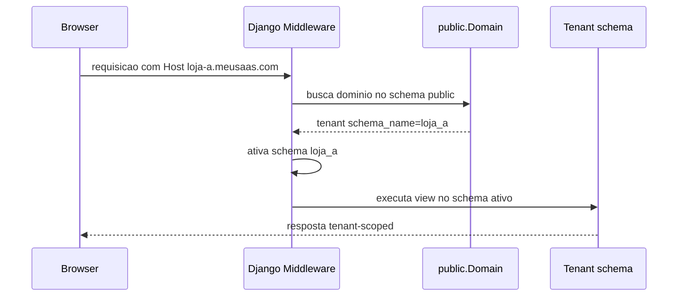
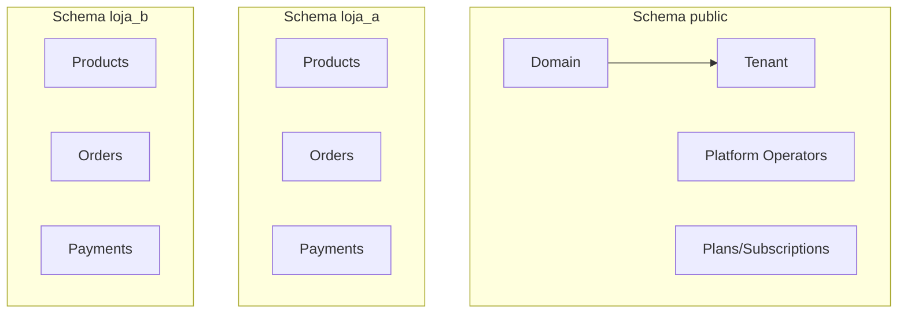

# Arquitetura Multi-Tenant

O futuro SaaS deve usar multi-tenancy por schema PostgreSQL com `django-tenants`.

## Decisao

- Um schema por empresa/loja.
- `public` somente para plataforma.
- Dados operacionais somente no schema do tenant.
- Tenant identificado exclusivamente por `Host`.
- Cada tenant sera isolado por Host/subdominio.
- Usuario nao escolhe tenant por query string, header customizado ou payload.
- Cookies de sessao e CSRF devem ser host-only, sem dominio compartilhado.

A decisao detalhada de autenticacao, sessao, cookies, CSRF e contexto de seguranca por Host esta em [17 - Isolamento por Host e Autenticacao](17-ISOLAMENTO_HOST_AUTH.md).

## Public Schema

O schema `public` contem:

- Tenant/Empresa/Loja.
- Domain.
- Operadores da plataforma.
- Planos do SaaS.
- Assinaturas do SaaS.
- Billing da plataforma.
- WebhookIngressRegistry.
- Configuracoes globais.
- Auditoria global.

Nao contem:

- produtos;
- pedidos;
- clientes finais;
- carrinhos;
- pagamentos de loja;
- estoque;
- imagens de produto;
- cupons.

## Tenant Schema

Cada schema de tenant contem:

- usuarios da loja;
- roles e permissoes;
- produtos;
- categorias;
- estoque;
- carrinhos;
- pedidos;
- pagamentos;
- clientes finais;
- enderecos;
- cupons;
- auditoria da loja.

`Customer` e sempre cliente final do tenant. Ele nao representa o cliente da plataforma e nao deve viver no `public`.

O mesmo e-mail, CPF ou telefone pode existir em tenants diferentes como registros independentes. Uma loja nao deve consultar nem inferir dados de compradores de outra loja.

## Resolucao por Host

Host desconhecido deve retornar erro seguro. Nunca fazer fallback para tenant padrao.

Nao aceitar identificacao de tenant por:

- query string;
- header customizado;
- payload;
- campo enviado pelo frontend;
- cookie editavel pelo usuario.

O `Host` e a unica entrada autorizada para resolver o tenant na aplicacao web.

## Separacao Public x Tenant

## Regras de Isolamento

- Querysets operacionais dependem apenas do schema ativo.
- IDs podem repetir entre tenants.
- Autenticacao, sessao, CSRF, cache, carrinho, pedidos e pagamentos sao independentes por Host/subdominio.
- Cache inclui `schema_name`.
- Throttling inclui `schema_name`, usuario e IP.
- Logs incluem `schema_name`.
- Arquivos, exports, backups e temporarios incluem `schema_name`.
- Sessoes sao host-only.
- Cookies nao usam `Domain=.meusaas.com` para sessao ou CSRF.
- Commands tenant-only exigem schema.
- Jobs recebem schema explicitamente.
- Exports e backups usam paths tenant-scoped.
- Webhooks validam tenant por referencia confiavel.
- Customer, carrinho, pedido, sessao e reset de senha sao tenant-scoped.

## Riscos e Mitigacoes

| Risco | Mitigacao |
| --- | --- |
| Tenant por query string | Proibir. Usar somente Host |
| Host desconhecido | 404/erro seguro, sem fallback |
| Cache compartilhado | Prefixo por schema/host |
| Throttling compartilhado | Chaves por schema, usuario e IP |
| Cookie com dominio compartilhado | Cookies host-only, sem `Domain=.meusaas.com` |
| Tenant por header/payload | Proibir. Usar somente Host |
| Task sem schema | Assinatura obrigatoria com `schema_name` |
| Command no public | Guard de schema |
| Export global | Export tenant-scoped |
| Admin misto | Admin publico e tenant separados ou desativado |
| Customer global por padrao | Proibir inicialmente. Customer pertence ao schema do tenant |
| Reset de senha global | Reset tenant-aware validando Host |

Tenant lifecycle, suspensao, bloqueio e delecao segura ficam em [35 - Tenant Lifecycle](35-TENANT_LIFECYCLE.md).

## Testes Obrigatorios

- Tenant A nao ve produtos do tenant B.
- IDs iguais retornam dados do schema do Host.
- Sessao de tenant A nao autentica tenant B.
- Cookie de tenant A nao e enviado/usado como sessao valida em tenant B.
- CSRF de tenant A nao valida mutacao em tenant B.
- Cache e throttling nao colidem entre tenants.
- Comprador com mesmo e-mail em dois tenants gera Customers independentes.
- Reset de senha no tenant A nao afeta tenant B.
- Host desconhecido retorna erro.
- `public` nao tem tabelas operacionais.
- Commands operacionais recusam `public`.
