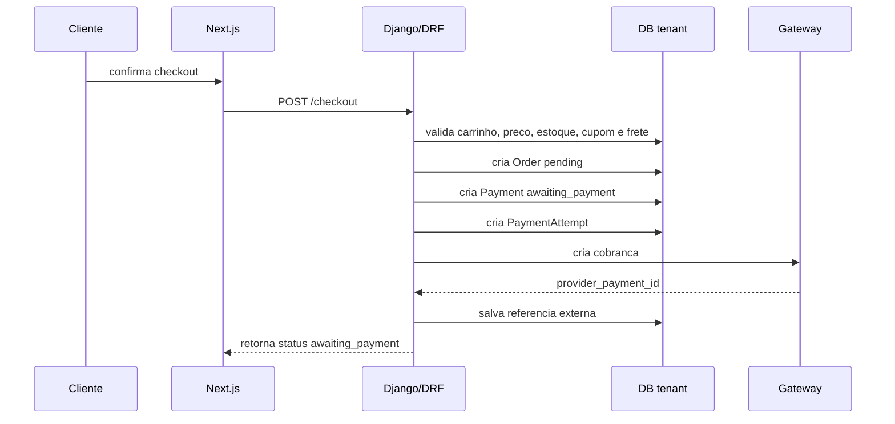
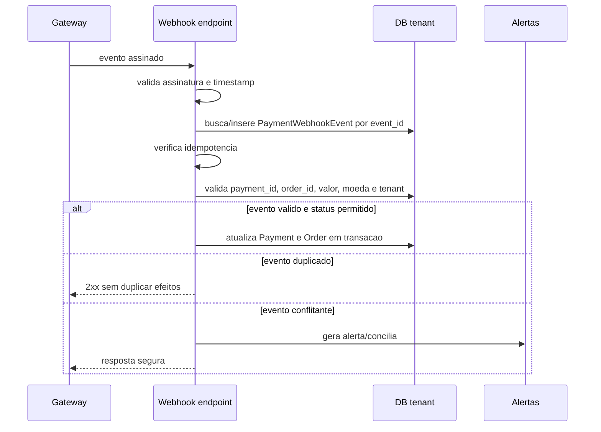

# Pagamentos e Webhooks

Pagamentos sao area critica. O desenho deve nascer seguro.

## Principio

Pedido nunca vira `paid` por acao do frontend. A confirmacao confiavel vem do gateway por webhook assinado e validado, ou por conciliacao segura.

Cada tenant pode ter provedores e modos de pagamento proprios. A decisao completa sobre checkout, compra como convidado, pagamento manual e `PaymentProviderConfig` esta em [18 - Checkout e Pagamentos por Tenant](18-CHECKOUT_PAGAMENTOS_POR_TENANT.md).

Cancelamentos, reembolsos e chargebacks devem seguir [20 - Cancelamentos, Reembolsos e Chargeback](20-CANCELAMENTOS_REEMBOLSOS_CHARGEBACK.md).

Webhook routing, tenant resolution e segredos de gateway seguem [33 - Webhook Routing e Secret Management](33-WEBHOOK_ROUTING_SECRET_MANAGEMENT.md).

Estados canonicos de pedido, pagamento, reembolso e chargeback estao em [34 - State Machines Canonicas](34-STATE_MACHINES_CANONICAS.md).

## Entidades

- `Order`: intencao comercial.
- `Payment`: estado financeiro interno.
- `PaymentAttempt`: tentativa de pagamento.
- `PaymentWebhookEvent`: evento recebido do gateway.
- `PaymentProviderConfig`: configuracao de gateway/metodo de pagamento do tenant.
- `ManualPaymentConfirmation`: confirmacao manual auditada.
- `Refund`: devolucao.
- `Chargeback`: contestacao.
- `Settlement/Reconciliation`: conciliacao.

## Fluxo Seguro de Checkout



## Fluxo Seguro de Webhook



## Estados

A fonte canonica de estados e transicoes e [34 - State Machines Canonicas](34-STATE_MACHINES_CANONICAS.md).

Status externo do gateway deve ser armazenado separadamente e mapeado para status interno canonico.

## Validacoes Obrigatorias do Webhook

- Assinatura.
- Timestamp.
- Idempotencia por `event_id`.
- Provider correto.
- Payment reference correta.
- Order reference correta.
- Valor.
- Moeda.
- Tenant/schema resolvido pelo registry de webhook.
- Status permitido pela maquina de estados.
- `PaymentProviderConfig` ativo no tenant correto.

## Eventos Conflitantes

Evento conflitante nao deve ser corrigido silenciosamente.

Exemplos:

- gateway envia `paid` com valor divergente;
- evento `failed` chega depois de `paid`;
- tenant esperado nao confere;
- provider esperado nao confere;
- payment id desconhecido;
- moeda divergente.

Acao:

- registrar auditoria;
- gerar alerta;
- marcar evento como `requires_review`;
- nao liberar pedido automaticamente.

## Conciliacao

Job por tenant:

```text
reconcile_gateway_payments(schema_name, provider, period)
```

Deve:

- consultar gateway com timeout;
- comparar pagamentos locais;
- detectar divergencias;
- gerar alerta;
- nunca misturar tenants;
- nao corrigir caso ambiguo sem revisao.

Reembolsos e chargebacks devem ser idempotentes, auditados e conciliaveis.

## Anti-Padroes

- Frontend marcar pedido como pago.
- Webhook sem assinatura.
- Webhook sem idempotencia.
- Ignorar valor/moeda.
- Usar status externo diretamente.
- Corrigir conflito silenciosamente.
- Logar dados sensiveis de cartao.
- Logar segredo de gateway.
- Compartilhar credencial de pagamento entre tenants.
- Confirmar pagamento manual sem permissao e auditoria.
- Tratar chargeback como cancelamento simples.
- Reembolsar sem validar saldo reembolsavel.
- Processar webhook fora de transacao.
