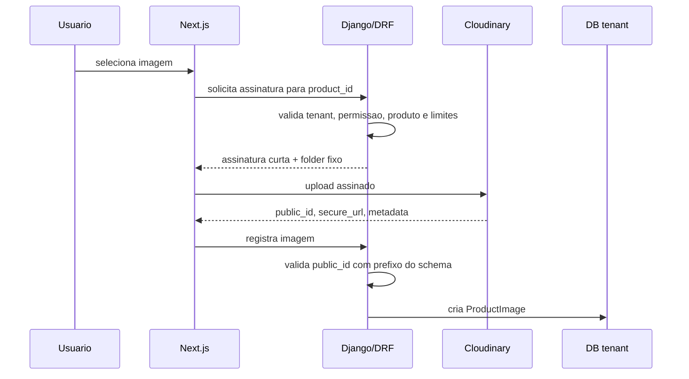

# Cloudinary e Imagens

Imagens de produto devem ficar fora do banco. O banco guarda metadados e referencias.

Uploads que nao sejam imagens de produto, como anexos, comprovantes e documentos, devem seguir [29 - Uploads, Anexos e Documentos](29-UPLOADS_DOCUMENTOS.md).

## Modelo

`ProductImage` deve pertencer ao tenant e ao produto.

Campos sugeridos:

- `product`;
- `cloudinary_public_id`;
- `secure_url`;
- `folder`;
- `width`;
- `height`;
- `format`;
- `bytes`;
- `uploaded_by`;
- `schema_name` para auditoria defensiva;
- `created_at`;
- `deleted_at`.

## Folder Seguro

```text
tenants/<schema>/products/<product_id>/<image_id>
```

O schema deve vir do backend. O frontend nunca escolhe o folder livremente.

## Fluxo Seguro de Upload



## Validacoes

- Produto existe no schema ativo.
- Usuario tem permissao.
- Tipo de arquivo permitido.
- Tamanho maximo.
- Dimensoes maximas.
- `public_id` comeca com `tenants/<schema>/`.
- `folder` confere com tenant e produto.
- URL publica nao e usada como autorizacao.

## Exclusao

Padrao seguro:

- marcar imagem como removida;
- remover associacao do produto;
- agendar exclusao no Cloudinary com schema explicito;
- auditar acao;
- reprocessar falhas.

## Jobs

Tasks devem receber schema:

```text
cleanup_cloudinary_image(schema_name, product_image_id)
cleanup_tenant_cloudinary_folder(schema_name)
```

Nunca varrer todos os tenants sem processo de plataforma auditado.

## Anti-Padroes

- Aceitar `secure_url` arbitraria.
- Aceitar `public_id` de outro tenant.
- Upload sem autenticacao.
- Upload sem limite.
- Assinatura sem expiracao.
- Folder definido pelo frontend.
- Deletar imagem fisica sem auditoria.
