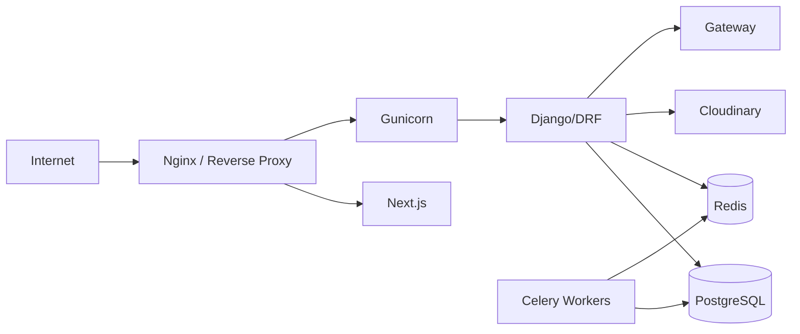
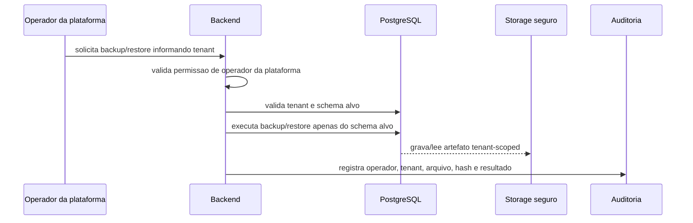

# Deploy e Infraestrutura

Arquitetura sugerida para producao.

## Componentes

## Nginx

- HTTPS.
- redirect HTTP para HTTPS.
- headers de seguranca.
- limite de upload.
- proxy para Next.js e Django.
- preservar Host.

## Gunicorn/Django

- variaveis de ambiente;
- `DEBUG=False`;
- `ALLOWED_HOSTS` restrito;
- logs estruturados;
- healthcheck;
- timeouts.

## PostgreSQL

- backups;
- restore testado;
- usuario com menor privilegio;
- conexao TLS quando aplicavel;
- monitorar conexoes;
- indices.

## Redis

- nao publico;
- autenticado;
- usado para cache, rate limit, locks e filas;
- keys tenant-aware.

## Celery/Workers

- tasks com schema explicito;
- retries seguros;
- dead-letter ou fila de falhas;
- idempotencia;
- logs com tenant.

## Cloudinary

- secrets por ambiente;
- upload assinado;
- folder por tenant;
- limites de tamanho;
- rotina de limpeza.

## CI/CD

Pipeline minimo:

- lint;
- typecheck frontend;
- testes backend;
- testes frontend;
- audit de dependencias;
- build;
- makemigrations check;
- smoke tests;
- deploy com aprovacao.

## Variaveis e Secrets

- `.env` nunca no Git.
- secrets por ambiente.
- rotacao definida.
- minimo privilegio.
- registrar dono de cada segredo.

Segredos de gateways devem usar secret manager ou envelope encryption com referencia segura, conforme [33 - Webhook Routing e Secret Management](33-WEBHOOK_ROUTING_SECRET_MANAGEMENT.md).

## Dominios

- subdominios por tenant;
- dominios customizados verificados;
- HTTPS antes de liberar;
- Host validado no backend.

Detalhes de dominio canonico, multiplos dominios por tenant, verificacao de propriedade e renovacao de certificados estao em [24 - Dominios](24-DOMINIOS.md).

## Backups e Restore

- backup plataforma separado;
- backup por tenant;
- restore por tenant;
- teste periodico de restore;
- auditoria de restore.

O plano completo de recuperacao, RPO/RTO e restore por tenant esta em [27 - Disaster Recovery](27-DISASTER_RECOVERY.md).

Fluxo seguro de backup/restore por tenant:

Regras:

- administrador de tenant nao executa backup global;
- arquivo de backup deve carregar identificador do tenant e hash;
- restore deve exigir tenant explicito, confirmacao humana e auditoria;
- backup de plataforma e backup de tenant nao compartilham permissao nem caminho logico;
- falha de restore deve gerar alerta e nunca aplicar correcao silenciosa.

## Anti-Padroes

- deploy com `DEBUG=True`;
- Redis publico;
- banco sem backup;
- secrets no repositorio;
- worker processando task sem schema;
- HTTPS ausente em producao.
