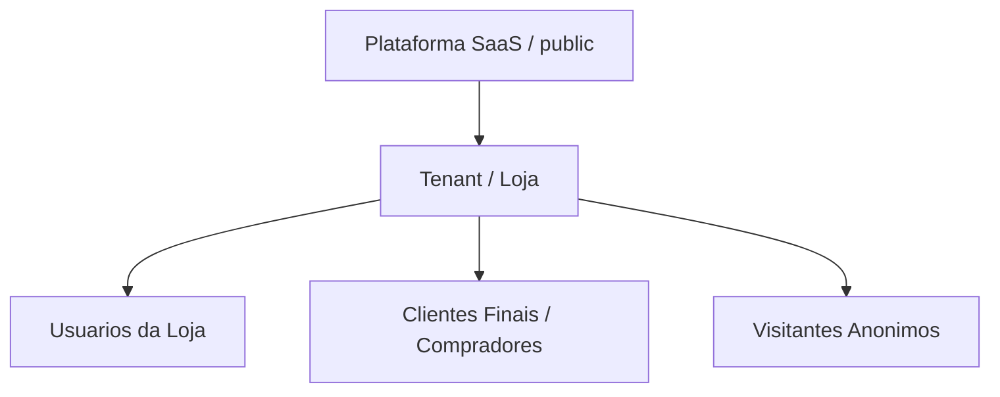
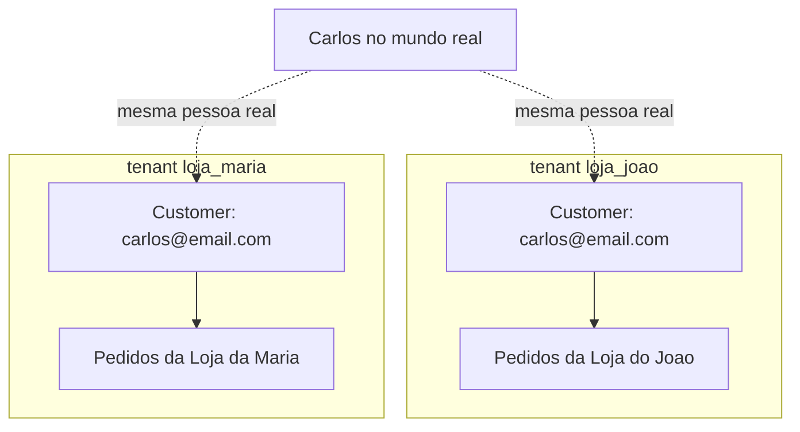
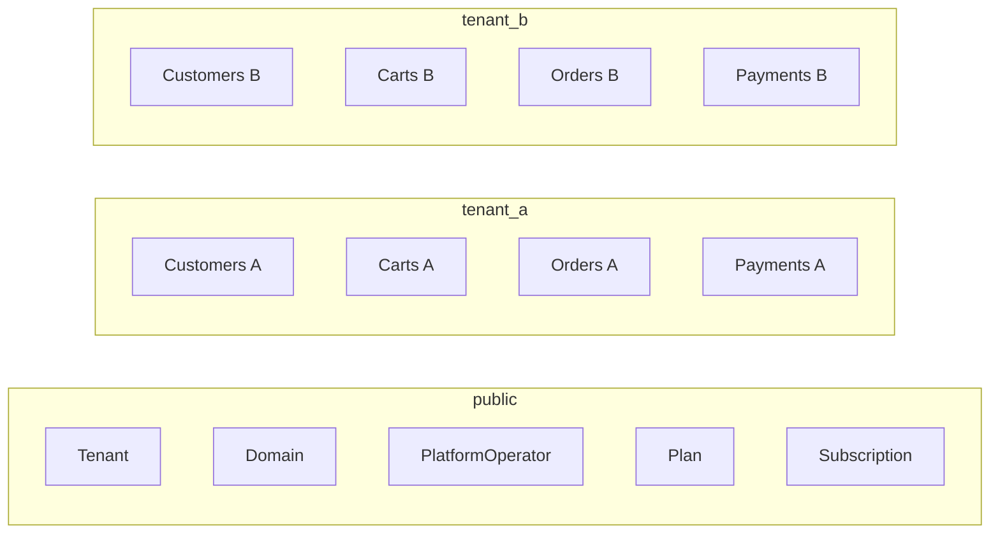
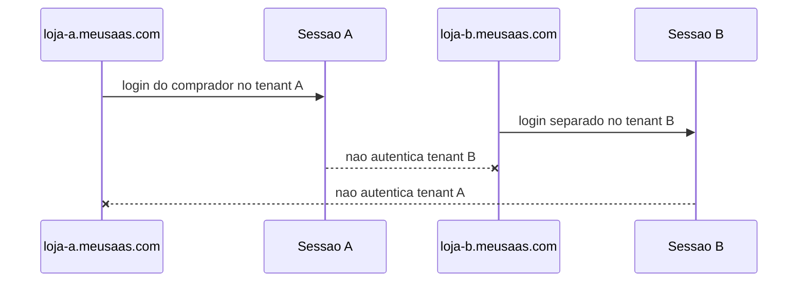

# Atores, Clientes e Identidades

Este capitulo define a separacao entre atores do SaaS de vendas/e-commerce.

A regra principal e: cliente da plataforma, usuario da loja e cliente final/comprador pertencem a contextos diferentes. Eles nao devem compartilhar model, permissao, sessao ou escopo de dados.

## Separacao de Atores

### Operador da Plataforma

E a pessoa ou equipe que opera o SaaS.

Responsabilidades:

- gerenciar tenants/lojas;
- gerenciar dominios;
- gerenciar planos e assinaturas do SaaS;
- operar suporte global;
- acompanhar saude da plataforma;
- executar operacoes sensiveis auditadas.

Limites:

- fica ligado ao schema `public`;
- nao e administrador automatico de nenhuma loja;
- nao deve acessar dados de cliente final sem fluxo explicito, menor privilegio e auditoria.

### Cliente da Plataforma / Loja / Tenant

E a empresa que contrata ou usa o SaaS para vender.

Exemplos:

- Loja do Joao;
- Loja da Maria;
- uma marca, comercio local, distribuidor ou vendedor profissional.

Responsabilidades:

- vender produtos;
- gerenciar catalogo;
- atender compradores;
- acompanhar pedidos e pagamentos da propria loja;
- administrar usuarios internos da propria loja.

Limites:

- cada loja e um tenant;
- cada loja possui seu proprio schema PostgreSQL;
- uma loja nao acessa dados, compradores, pedidos, carrinhos ou relatorios de outra loja.

### Administrador da Loja

E o usuario interno com maior permissao dentro de uma loja.

Responsabilidades:

- configurar dados da loja;
- gerenciar usuarios internos;
- gerenciar catalogo, pedidos, cupons e operacao;
- acessar relatorios da propria loja.

Limites:

- pertence ao schema do tenant;
- nao e operador da plataforma;
- nao acessa o schema `public`;
- nao acessa dados de outra loja.

### Usuarios Internos da Loja

Sao colaboradores do tenant.

Exemplos:

- gerente;
- financeiro;
- estoque;
- atendimento;
- separacao/expedicao.

Responsabilidades e limites devem ser definidos por roles e permissions dentro do tenant atual.

### Cliente Final / Comprador

E a pessoa que compra produtos dentro de uma loja.

Exemplo:

- Carlos compra na Loja do Joao.
- Carlos tambem pode comprar na Loja da Maria.

Mesmo que Carlos seja a mesma pessoa no mundo real, tecnicamente ele deve ser tratado como registros separados em cada tenant:

```text
loja_joao.customer: carlos@email.com
loja_maria.customer: carlos@email.com
```

A Loja do Joao nao pode saber, acessar ou inferir que Carlos tambem compra na Loja da Maria.

### Visitante Anonimo

E quem navega na loja sem login.

Pode:

- visualizar catalogo publico;
- adicionar itens ao carrinho anonimo, se a regra da loja permitir;
- iniciar checkout conforme regra da loja.

Limites:

- o carrinho anonimo pertence a sessao do tenant atual;
- carrinho anonimo de um tenant nao aparece em outro tenant;
- ao autenticar, o carrinho anonimo so pode ser associado ao `Customer` do mesmo tenant.

## Cliente da Plataforma x Cliente Final

`Cliente da plataforma` e a empresa/loja que usa o SaaS.

`Cliente final` e o comprador da loja.

Eles pertencem a contextos diferentes:

- cliente da plataforma vive como Tenant/Subscription/Billing no `public`;
- cliente final vive como Customer dentro do schema do tenant;
- cliente da plataforma usa permissoes de operacao da loja/plataforma;
- cliente final usa permissao de compra, perfil, pedidos e carrinho;
- sessoes de operadores, usuarios internos e clientes finais devem ter escopo claro.

Eles nao devem usar os mesmos models, permissoes ou sessoes.

## Hierarquia



## Mesmo Comprador em Tenants Diferentes



`CustomerA` e `CustomerB` sao registros independentes. Nao existe relacao tecnica global entre eles por padrao.

## Isolamento do Cliente Final entre Tenants

Regras:

- `Customer` pertence ao schema do tenant;
- mesmo e-mail pode existir em tenants diferentes;
- mesmo CPF/telefone pode existir em tenants diferentes, conforme regra de negocio, necessidade real e LGPD;
- dados do cliente final nao devem ficar no `public`;
- plataforma nao deve criar perfil global de comprador sem decisao explicita, base legal e necessidade real;
- tenant A nao consulta clientes finais do tenant B;
- tenant A nao infere comportamento de compra do cliente em tenant B;
- IDs de Customer, Order e Cart podem repetir entre tenants.

## Dados Separados



## Autenticacao e Sessao do Cliente Final

Opcao recomendada inicialmente:

- cliente final autentica por loja/tenant;
- sessao/cookie e host-only;
- cookie de sessao e CSRF nao usa `Domain=.meusaas.com`;
- login em `loja-a.meusaas.com` nao autentica automaticamente em `loja-b.meusaas.com`;
- carrinho, pedidos e perfil ficam restritos ao tenant;
- reset de senha considera o tenant e o Host atual;
- permissoes sao resolvidas dentro do tenant atual.



Regras:

- cookie de uma loja nao deve valer para outra loja;
- CSRF de uma loja nao deve validar requisicao mutavel em outra loja;
- e-mail igual em duas lojas nao significa mesma conta tecnica;
- logout deve afetar apenas a sessao daquele host, salvo decisao futura diferente;
- reset de senha em uma loja nao deve alterar conta de outra loja;
- token ou link de reset deve carregar contexto seguro do tenant.

Os modos de compra podem variar por tenant. A decisao completa sobre login obrigatorio, compra como convidado, cadastro no checkout e pagamentos por loja esta em [18 - Checkout e Pagamentos por Tenant](18-CHECKOUT_PAGAMENTOS_POR_TENANT.md).

## Cliente Final Anonimo

Visitante anonimo pode adicionar itens ao carrinho sem login, se o produto e a loja permitirem.

Regras:

- carrinho anonimo pertence a sessao do tenant atual;
- carrinho anonimo de um tenant nao aparece em outro tenant;
- no checkout, pode ser exigido login, cadastro ou compra como convidado;
- compra como convidado deve criar `Customer` ou `GuestCustomer` apenas no schema do tenant atual;
- ao autenticar, carrinho anonimo pode ser associado ao `Customer` do mesmo tenant;
- carrinho anonimo nao deve ser migrado entre hosts/tenants.

## Conta Global de Comprador

Conta global de comprador nao sera assumida inicialmente.

Decisao recomendada:

- cliente final e tenant-scoped, nao global.

Se no futuro existir conta global de comprador, isso deve ser uma decisao arquitetural separada e exigir:

- ADR proprio;
- base legal/LGPD clara;
- consentimento;
- isolamento por tenant mesmo com identidade global;
- regra impedindo que uma loja veja atividade do comprador em outra loja;
- desenho proprio de autenticacao, autorizacao, privacidade, suporte, exclusao e portabilidade.

## Modelagem

### Schema `public`

- `Tenant`
- `Domain`
- `PlatformOperator`
- `Plan`
- `Subscription`
- `PlatformBillingEvent`
- `GlobalConfig`
- `PlatformAuditLog`

### Schema do Tenant

- `StoreUser`
- `Role`
- `Permission`
- `Customer`
- `CustomerAddress`
- `Cart`
- `CartItem`
- `Order`
- `OrderItem`
- `Payment`
- `PaymentAttempt`
- `PaymentWebhookEvent`
- `Product`
- `ProductImage`
- `Category`
- `StockMovement`
- `Coupon`
- `AuditLog`

`Customer` e o cliente final do tenant. Ele nao e o cliente da plataforma.

## Seguranca e Privacidade

| Ameaca | Mitigacao |
| --- | --- |
| Loja A tenta consultar cliente da Loja B | Schema por tenant, queries no schema ativo e testes de isolamento |
| Mesmo e-mail em tenants diferentes gera confusao de sessao | Cookie host-only, autenticacao por Host e sessao tenant-aware |
| Plataforma cria base global de compradores sem necessidade | Nao armazenar cliente final no `public` inicialmente |
| Suporte da plataforma acessa dados de comprador sem auditoria | Fluxo de suporte auditado, menor privilegio e logs com tenant/user/action |
| Reset de senha em uma loja afeta conta de outra loja | Reset tenant-aware e dominio/Host validado |
| E-mail usado como identificador global | Identidade tecnica limitada ao schema do tenant |

## Testes Obrigatorios

- Mesmo e-mail cadastrado como cliente final em dois tenants diferentes.
- Login do comprador no tenant A nao autentica no tenant B.
- Carrinho anonimo do tenant A nao aparece no tenant B.
- Pedido do comprador no tenant A nao aparece no tenant B.
- Reset de senha do tenant A nao afeta tenant B.
- Customer com mesmo e-mail em tenants diferentes tem IDs e dados independentes.
- Operador da loja nao acessa clientes finais de outro tenant.
- Operador da plataforma so acessa dados de comprador via fluxo auditado, se existir.
- Logout em um host nao encerra sessao independente de outro host.

## O Que Nao Fazer

- Nao colocar Customer final no schema `public` sem decisao explicita.
- Nao criar login global de comprador por padrao.
- Nao compartilhar sessao entre lojas.
- Nao compartilhar CSRF entre lojas.
- Nao usar cookie de sessao ou CSRF com `Domain=.meusaas.com`.
- Nao permitir que loja A consulte comprador da loja B.
- Nao usar e-mail como identificador global entre tenants.
- Nao permitir reset de senha global para contas tenant-scoped.
- Nao expor historico de compras cruzado entre lojas.
- Nao misturar cliente da plataforma com cliente final.
- Nao criar perfil global de comportamento de compra sem base legal e consentimento.
