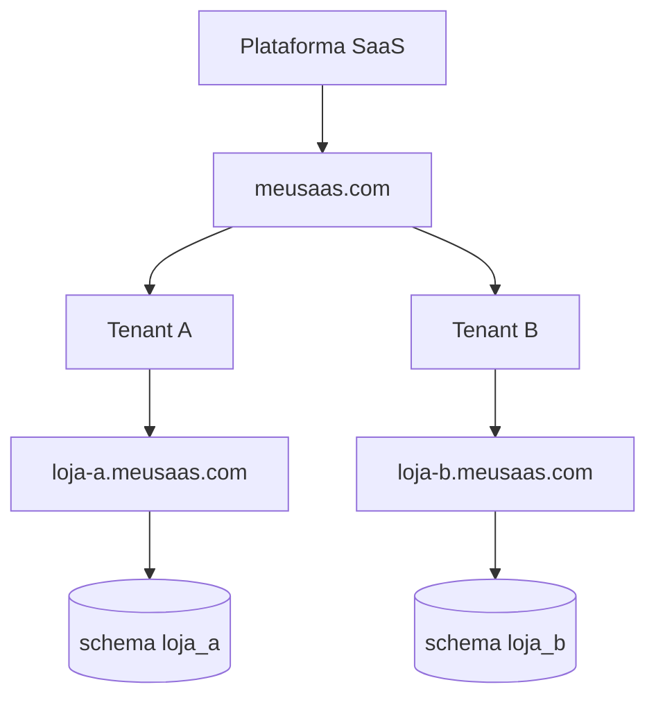
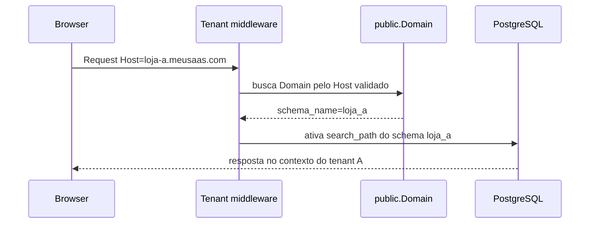
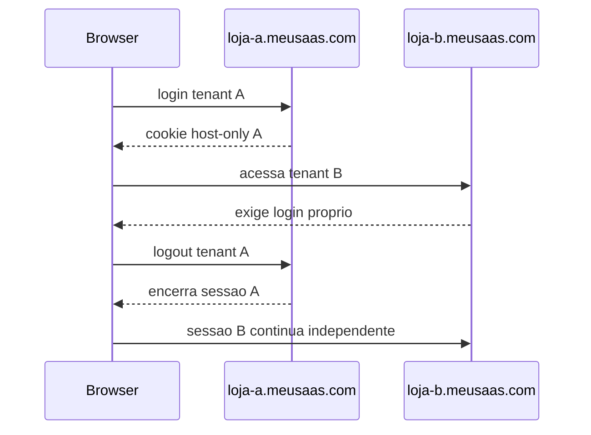

# Isolamento por Host, Autenticacao e Contexto de Seguranca

Este capitulo registra a decisao arquitetural de isolamento completo por Host/subdominio para o futuro SaaS de vendas/e-commerce.

A decisao prioriza seguranca, privacidade, isolamento entre tenants e reducao da superficie de ataque, mesmo aumentando a complexidade de implementacao.

## Decisao Final

O projeto adota isolamento completo por Host.

Cada tenant possui autenticacao, sessao, cookies, CSRF, cache, carrinho, pedidos, pagamentos e contexto de seguranca independentes.

O dominio principal da plataforma e usado apenas para funcionalidades administrativas da plataforma.

Nao existe compartilhamento automatico de autenticacao entre tenants.

O tenant e resolvido exclusivamente pelo `Host` da requisicao.

Nunca resolver tenant por:

- query string;
- parametro de URL;
- body;
- header customizado;
- token enviado pelo frontend;
- cookie editavel pelo usuario.

## Arquitetura dos Dominios

Dominio principal:

- landing page;
- cadastro de novas lojas;
- documentacao;
- painel da plataforma;
- administracao global;
- suporte;
- operacao de planos, assinaturas e dominios.

Subdominios:

- representam tenants/lojas;
- possuem contexto independente;
- resolvem automaticamente o schema correto;
- isolam autenticacao, sessao, cookies, CSRF, cache e dados operacionais.



## Resolucao Segura do Tenant



Host desconhecido deve retornar erro seguro. Nunca fazer fallback para tenant padrao.

## Autenticacao por Host

Todos autenticam apenas dentro do Host correspondente:

```text
Operador da Plataforma -> meusaas.com
Administrador da Loja -> loja-a.meusaas.com
Funcionario da Loja -> loja-a.meusaas.com
Cliente Final -> loja-a.meusaas.com
```

Regras:

- operador da plataforma autentica no dominio principal;
- administrador da loja autentica no subdominio da loja;
- funcionario autentica no subdominio da loja;
- cliente final autentica no subdominio da loja;
- nao existe login global de tenant por padrao;
- login em uma loja nao autentica outra loja;
- reset de senha e tenant-aware e Host-aware.

## Sessoes

Cada tenant possui sessao completamente independente.

Regras:

- nao compartilhar sessoes entre lojas;
- cada autenticacao pertence ao Host atual;
- logout afeta apenas o tenant atual;
- sessao de `loja-a.meusaas.com` nao autentica `loja-b.meusaas.com`;
- sessao do dominio principal nao autentica automaticamente um tenant.



## Cookies

Nao utilizar `Domain=.meusaas.com` para cookies de autenticacao, sessao ou CSRF dos tenants.

Cookies devem ser Host-Only.

Exemplo:

- cookie criado em `loja-a.meusaas.com` nao deve ser enviado para `loja-b.meusaas.com`;
- cookie criado em `meusaas.com` nao deve autenticar automaticamente `loja-a.meusaas.com`;
- cada subdominio cria seus proprios cookies.

Comparacao:

| Modelo | Como funciona | Risco | Decisao |
| --- | --- | --- | --- |
| Cookie compartilhado | Usa `Domain=.meusaas.com` | Cookie pode circular entre subdominios e aumentar impacto de subdominio comprometido | Nao usar |
| Host-Only Cookie | Cookie pertence apenas ao host que o criou | Menor superficie de ataque e menor confusao de sessao | Usar |

Beneficios de seguranca:

- reduz risco de cookie confusion;
- reduz risco de session confusion;
- reduz impacto de subdominio comprometido;
- impede login automatico entre lojas;
- facilita testes de isolamento.

## CSRF

Cada tenant possui seu proprio token CSRF.

Regras:

- token CSRF pertence ao Host;
- nao compartilhar token entre tenants;
- nao usar configuracoes excessivamente permissivas;
- CSRF trusted origins devem ser restritos;
- token de `loja-a.meusaas.com` nao valida mutacao em `loja-b.meusaas.com`.

Protege contra:

- Cross-Tenant Request Forgery;
- Session Confusion;
- Cookie Confusion;
- mutacoes acidentais ou maliciosas em outro subdominio.

## Cache

Toda chave de cache ligada a tenant deve conter:

- `schema_name`;
- tenant;
- Host;
- usuario ou sessao quando aplicavel;
- endpoint/escopo funcional quando aplicavel.

Exemplos conceituais:

```text
cache:{schema_name}:{host}:produto:15
cache:{schema_name}:{host}:pedido:40
cache:{schema_name}:{host}:cart:{session_id}
cache:{schema_name}:{host}:customer:{customer_id}
```

Isso evita:

- vazamento de dados entre tenants;
- retorno de carrinho errado;
- leitura de pedido de outra loja;
- colisao de IDs repetidos entre schemas;
- cache poisoning entre subdominios.

## Rate Limit

Rate limit deve considerar:

- tenant/schema;
- usuario;
- IP;
- Host;
- endpoint;
- tipo de operacao.

Endpoints sensiveis:

- login;
- logout;
- reset de senha;
- checkout;
- pagamento;
- webhook;
- upload;
- export;
- backup/download.

Isolamento por Host melhora a seguranca porque um tenant nao consome nem burla o limite de outro, e ataques contra uma loja ficam mais faceis de detectar.

## Cliente Final

O mesmo cliente final pode existir em varias lojas, mas como registros separados em cada schema.

O mesmo e-mail pode existir em varios tenants.

O mesmo CPF pode existir em varios tenants, conforme regra de negocio, necessidade real e LGPD.

Nunca compartilhar automaticamente entre tenants:

- sessao;
- carrinho;
- pedidos;
- enderecos;
- favoritos;
- historico;
- perfil;
- tokens de reset;
- preferencias.

## Ameacas e Mitigacoes

| Ameaca | Risco | Mitigacao |
| --- | --- | --- |
| Cookie compartilhado entre lojas | Reuso de autenticacao e maior impacto de subdominio comprometido | Host-Only Cookies |
| Sessao reutilizada entre tenants | Usuario autenticado em uma loja aparecer autenticado em outra | Sessao por Host |
| CSRF compartilhado | Mutacao cross-tenant | Token CSRF por Host |
| Cache compartilhado | Vazamento de carrinho, pedido, perfil ou produto | Cache tenant-aware com `schema_name` e Host |
| Rate limit global sem tenant | Bypass ou bloqueio indevido entre lojas | Throttling por schema, Host, usuario, IP e endpoint |
| Tenant escolhido pelo frontend | Troca maliciosa de tenant | Resolver exclusivamente pelo Host |
| Subdominio comprometido | Expansao do ataque para outros tenants | Isolamento de cookies, sessao, CSRF, cache e schema |
| Mesmo comprador em duas lojas | Inferencia de comportamento ou cadastro cruzado | Customer tenant-scoped |
| Reset de senha global | Alteracao de conta em outra loja | Reset tenant-aware e Host-aware |

## Testes Arquiteturais Obrigatorios

No mesmo navegador, autenticar simultaneamente em:

- `loja-a.meusaas.com`;
- `loja-b.meusaas.com`.

Confirmar:

- cookies diferentes;
- sessoes diferentes;
- tokens CSRF diferentes;
- cache diferente;
- chaves de throttling diferentes;
- logout da loja A nao afeta loja B;
- reset de senha da loja A nao interfere na loja B;
- cliente final da loja A nao aparece na loja B;
- carrinho da loja A nao aparece na loja B;
- pedido da loja A nao aparece na loja B;
- pagamento da loja A nao aparece na loja B;
- Host desconhecido nao faz fallback;
- tenant nao pode ser selecionado por query string, header customizado, body ou token do frontend.

## O Que Nao Fazer

- Nao usar `Domain=.meusaas.com` para cookies de sessao ou CSRF.
- Nao criar sessao global entre lojas.
- Nao criar login global de tenant.
- Nao aceitar tenant por query string.
- Nao aceitar tenant por header customizado.
- Nao aceitar tenant por payload.
- Nao aceitar tenant por token enviado pelo frontend.
- Nao usar cache sem `schema_name`.
- Nao usar throttling sem `schema_name`.
- Nao compartilhar carrinho, pedidos, pagamentos, historico ou favoritos entre tenants.
- Nao tratar e-mail do cliente final como identificador global.
