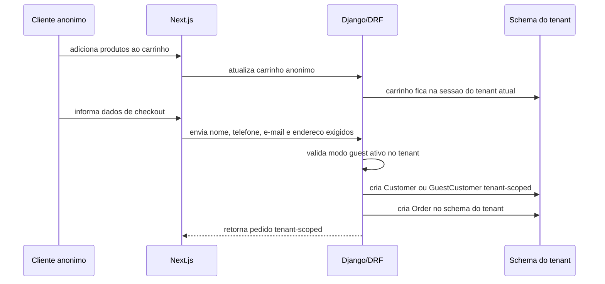
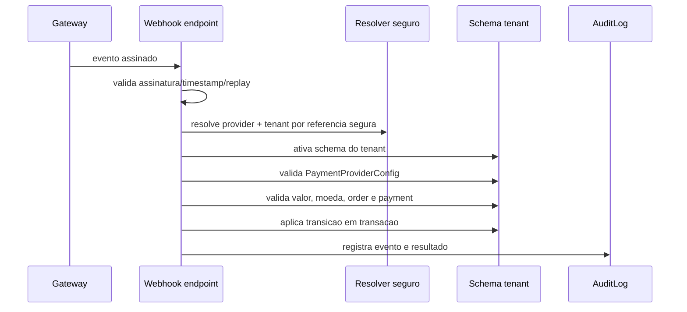

# Checkout, Autenticacao do Comprador e Pagamentos por Tenant

Este capitulo define como cada loja/tenant pode ter regras proprias de compra, autenticacao do cliente final e pagamento, sem abrir mao de isolamento, seguranca e consistencia financeira.

## Decisao Arquitetural

A autenticacao do cliente final sera tenant-scoped e configuravel por loja.

Cada tenant podera decidir entre compra com login obrigatorio, compra como convidado, cadastro no checkout, login opcional ou fluxos manuais.

Todos os fluxos devem ser validados pelo backend e isolados por Host/schema.

As configuracoes de pagamento serao tenant-scoped.

Cada loja podera usar provedores, maquininhas, Pix manual, cartao, pagamento na entrega ou gateway diferente, desde que credenciais, webhooks, pedidos e pagamentos sejam isolados e auditaveis.

State machines canonicas estao em [34 - State Machines Canonicas](34-STATE_MACHINES_CANONICAS.md).

Webhook routing e segredos de gateway seguem [33 - Webhook Routing e Secret Management](33-WEBHOOK_ROUTING_SECRET_MANAGEMENT.md).

## Autenticacao do Cliente Final por Tenant

Regras:

- cliente final pertence ao tenant;
- autenticacao do cliente final e isolada por Host/subdominio;
- nao existe login global de comprador inicialmente;
- mesmo e-mail pode existir em lojas diferentes como contas separadas;
- sessao e cookie sao host-only;
- carrinho, pedidos, enderecos e pagamentos sao tenant-scoped;
- reset de senha e tenant-aware e Host-aware.

Login em `loja-a.meusaas.com` nao autentica `loja-b.meusaas.com`.

## Modos de Compra Configuraveis por Loja

Cada tenant pode configurar quais modos de compra permite:

- compra apenas com login;
- compra como convidado;
- compra com cadastro obrigatorio apenas no checkout;
- compra com login opcional;
- orcamento/pedido manual sem pagamento online;
- pedido com pagamento na entrega;
- pedido com Pix manual;
- pedido com gateway online.

A flexibilidade e por tenant, mas a validacao final continua no backend.

O frontend pode exibir opcoes, mas o backend deve verificar:

- se o modo esta ativo para o tenant;
- se o metodo de pagamento esta ativo;
- se o usuario ou convidado tem permissao para continuar;
- se carrinho, preco, estoque, frete e cupom continuam validos;
- se o pedido sera criado no schema correto.

## Compra como Convidado

Fluxo seguro:



Regras:

- carrinho anonimo pertence a sessao do tenant atual;
- sessao/carrinho nao vale para outro tenant;
- dados minimos devem ser coletados;
- coleta deve respeitar LGPD;
- pedido de convidado pertence ao schema do tenant;
- acompanhamento de pedido deve usar token seguro, expiravel quando aplicavel, e sempre tenant-scoped;
- token de acompanhamento de uma loja nao consulta pedido de outra.

## Compra com Login

Fluxo seguro:

- cliente cria conta dentro da loja atual;
- login so vale no Host atual;
- reset de senha e tenant-aware;
- pedidos antigos aparecem apenas naquela loja;
- login na Loja A nao autentica na Loja B;
- carrinho anonimo pode ser associado ao Customer autenticado apenas no mesmo tenant.

## Configuracao de Pagamento por Tenant

Cada loja pode ter suas proprias configuracoes de pagamento.

Exemplos:

- Pix manual;
- Pix via gateway;
- cartao via gateway;
- boleto;
- pagamento na entrega;
- maquininha fisica;
- link de pagamento;
- Mercado Pago;
- PagSeguro;
- Stripe;
- Pagar.me;
- Cielo;
- outros provedores futuros.

Conceito recomendado:

```text
PaymentProviderConfig
```

`PaymentProviderConfig` deve pertencer ao schema do tenant ou ser fortemente vinculada ao tenant em armazenamento seguro. Nunca deve ser compartilhada de forma insegura.

Campos conceituais:

- provider;
- ambiente: sandbox/producao;
- credenciais protegidas;
- metodos habilitados;
- status ativo/inativo;
- metadata publica segura;
- data de rotacao;
- usuario que alterou;
- trilha de auditoria.

## Maquininha / Gateway Diferente por Loja

Exemplos:

- Loja A usa Mercado Pago.
- Loja B usa PagSeguro.
- Loja C usa Stripe.
- Loja D aceita apenas Pix manual.
- Loja E aceita pagamento na entrega.

A aplicacao deve suportar multiplos provedores por tenant, sem misturar:

- credenciais;
- webhooks;
- referencias externas;
- pedidos;
- pagamentos;
- logs;
- conciliacao.

## Credenciais de Pagamento

Regras:

- credenciais pertencem ao tenant;
- nunca salvar segredo em texto puro sem protecao;
- usar criptografia ou secret manager quando possivel;
- armazenar `secret_ref`, nao segredo exposto, quando usar registry/secret manager;
- nunca expor segredo no frontend;
- logs nunca devem conter segredo;
- respostas de API nunca retornam segredo;
- rotacao de credenciais deve ser prevista;
- ambiente sandbox e producao devem ser separados;
- alteracao de credencial deve gerar AuditLog;
- credencial desativada nao pode criar nova cobranca.

## Webhooks por Provedor e Tenant

Cada evento recebido deve:

- ser associado ao provider correto;
- validar assinatura do provider;
- validar tenant;
- validar valor;
- validar moeda;
- validar referencia externa;
- garantir idempotencia;
- evitar replay;
- processar com transacao;
- nunca marcar pedido como pago apenas por retorno do frontend.

Estrategias possiveis:

- endpoint unico que resolve tenant por referencia segura;
- endpoint por tenant/provider;
- metadata assinada enviada ao gateway;
- tabela `PaymentProviderConfig` com provider e tenant;
- referencia externa opaca contendo identificador verificavel, sem expor dado sensivel.

Recomendacao mais segura:

- webhook valida assinatura primeiro;
- identifica provider;
- resolve tenant por referencia confiavel ou metadata assinada;
- ativa schema do tenant;
- carrega `PaymentProviderConfig` do tenant;
- valida external_reference, valor, moeda, status e idempotencia;
- atualiza `Payment` e `Order` em transacao;
- registra auditoria e alerta em conflito.



## Pagamento Local / Manual

Casos:

- pagamento na entrega;
- Pix manual;
- maquininha fisica presencial;
- dinheiro;
- transferencia;
- link de pagamento externo confirmado manualmente.

Seguranca:

- pedido pode ficar como `awaiting_manual_confirmation`;
- confirmacao manual exige permissao especifica;
- confirmacao manual gera `AuditLog`;
- confirmacao manual registra usuario, data, IP, motivo e metodo;
- confirmacao manual nao usa o mesmo fluxo de `paid` automatico dos webhooks;
- alteracoes manuais devem ser rastreaveis;
- reversao ou cancelamento manual tambem deve ser auditado.

## Status de Pedido e Pagamento

Estados e transicoes canonicas ficam em [34 - State Machines Canonicas](34-STATE_MACHINES_CANONICAS.md).

Status externo do gateway deve ser armazenado separadamente. Status interno so muda por service validado.

## Ameacas e Mitigacoes

| Ameaca | Mitigacao |
| --- | --- |
| Loja A usar credencial da Loja B | `PaymentProviderConfig` isolado por tenant, validacao de schema e auditoria |
| Webhook de uma loja pagar pedido de outra | Validar tenant, provider, external_reference, valor, moeda e assinatura |
| Funcionario marcar pagamento manual indevido | Permissao especifica, AuditLog, motivo obrigatorio e revisao |
| Cliente manipular metodo de pagamento no frontend | Backend valida metodos ativos no tenant |
| Cliente convidado acessar pedido de outro convidado | Token seguro de acompanhamento, sessao tenant-scoped e validacoes por e-mail/telefone quando necessario |
| Segredo do gateway vazar em log/API/frontend | Scrub de logs, secrets protegidos, responses sem segredo e testes de vazamento |
| Metodo desativado continuar aceitando pagamento | Validacao backend em checkout e inicio de pagamento |

## Testes Obrigatorios

- Tenant A usa provider diferente do tenant B.
- Tenant A nao acessa credencial do tenant B.
- Webhook do tenant A nao paga pedido do tenant B.
- Metodo de pagamento desativado nao pode ser usado.
- Compra como convidado gera pedido apenas no tenant atual.
- Login do comprador em tenant A nao autentica tenant B.
- Pagamento manual exige permissao.
- Confirmacao manual gera auditoria.
- Segredo do gateway nao aparece em logs/API/frontend.
- Pedido manual nao vira `paid` pelo fluxo automatico de webhook.
- Token de acompanhamento de convidado do tenant A nao consulta pedido do tenant B.

## O Que Nao Fazer

- Nao deixar o frontend decidir metodo final de pagamento sem validacao backend.
- Nao compartilhar credenciais entre tenants.
- Nao usar uma unica credencial global para todos os tenants sem desenho explicito e seguro.
- Nao salvar segredo em texto puro.
- Nao logar segredo, token de gateway ou payload sensivel bruto.
- Nao aceitar webhook sem assinatura.
- Nao marcar pedido como pago por redirect do gateway.
- Nao confirmar pagamento manual sem permissao e auditoria.
- Nao permitir que compra como convidado crie pedido fora do schema ativo.
