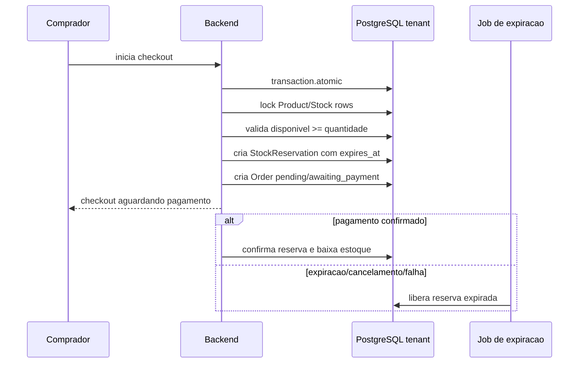

# Estoque e Concorrencia

Este capitulo define como impedir que o ultimo item seja vendido para dois compradores ao mesmo tempo.

## Problema

Em e-commerce, varios compradores podem tentar finalizar compra do mesmo produto simultaneamente.

Sem controle de concorrencia, o sistema pode:

- vender estoque inexistente;
- confirmar dois pedidos para o mesmo ultimo item;
- cobrar cliente sem conseguir atender;
- gerar ajuste manual e perda de confianca.

## Conceitos

- Estoque disponivel: quantidade real que pode ser vendida.
- Estoque reservado: quantidade separada temporariamente para um checkout/pedido.
- Estoque confirmado: quantidade baixada definitivamente apos pagamento ou confirmacao operacional.
- Reserva expirada: reserva liberada por timeout, cancelamento ou falha de pagamento.
- Rollback: desfazer reserva/baixa se a transacao falhar.

## Estrategias Possiveis

### Baixa Somente Apos Pagamento

O pedido e criado sem reservar estoque e o estoque e baixado quando o pagamento confirma.

Vantagem:

- simples.

Risco:

- varios compradores podem pagar pelo mesmo item se o estoque acabar entre checkout e webhook.

Nao recomendada para produtos com estoque limitado.

### Reserva Temporaria no Checkout

Ao iniciar checkout, o backend reserva o estoque por tempo limitado.

Vantagem:

- reduz overselling;
- permite expirar carrinhos abandonados;
- melhora consistencia.

Risco:

- exige job de expiracao e regras claras.

Recomendada como base.

### Lock Transacional no Produto/Estoque

Durante a reserva, o backend usa transacao e bloqueio de linha para garantir que apenas uma operacao altere o estoque de cada vez.

Vantagem:

- consistencia forte;
- evita corrida no ultimo item.

Risco:

- precisa cuidado com deadlocks e tempo de transacao.

Recomendada para operacoes criticas de estoque.

### Estoque Eventual por Fila

Checkout envia evento para fila e o estoque e processado depois.

Vantagem:

- escala melhor em alto volume.

Risco:

- maior complexidade;
- cliente espera resultado assincrono.

Nao adotar prematuramente. Avaliar apenas quando volume exigir.

## Estrategia Recomendada

Usar reserva temporaria de estoque com transacao e lock por item.

Estados canonicos de reserva e estoque ficam em [34 - State Machines Canonicas](34-STATE_MACHINES_CANONICAS.md).

Fluxo:

## Regras

- reserva, pedido e pagamento vivem no schema do tenant;
- reserva deve ter `expires_at`;
- checkout deve recalcular preco, estoque, frete e cupom no backend;
- pagamento confirmado so baixa estoque se a reserva ainda for valida ou se houver regra de revisao;
- expiracao deve liberar estoque de forma idempotente;
- cancelamento antes de pagamento libera reserva;
- reembolso nao repoe estoque automaticamente sem regra clara;
- alteracao manual de estoque exige auditoria.

## Rollback

Se qualquer etapa da transacao falhar:

- nao criar pedido parcial;
- nao criar reserva parcial;
- nao baixar estoque;
- retornar erro seguro;
- registrar evento tecnico quando necessario.

## Consistencia

Regras de consistencia:

- nunca confiar no estoque exibido pelo frontend;
- nunca vender com base em cache;
- usar banco como fonte da verdade;
- usar locks curtos e transacoes pequenas;
- validar com testes concorrentes;
- alertar divergencias entre estoque fisico, reservado e confirmado.

## Testes Obrigatorios

- dois checkouts simultaneos disputando o ultimo item: apenas um reserva.
- reserva expirada libera estoque.
- cancelamento antes do pagamento libera reserva.
- pagamento confirmado baixa estoque uma unica vez.
- webhook duplicado nao baixa estoque duas vezes.
- tenant A nao altera estoque do tenant B.

## O Que Nao Fazer

- Nao baixar estoque apenas no frontend.
- Nao vender item sem validar estoque no backend.
- Nao usar cache como fonte de disponibilidade.
- Nao manter reserva sem expiracao.
- Nao corrigir overselling silenciosamente.
