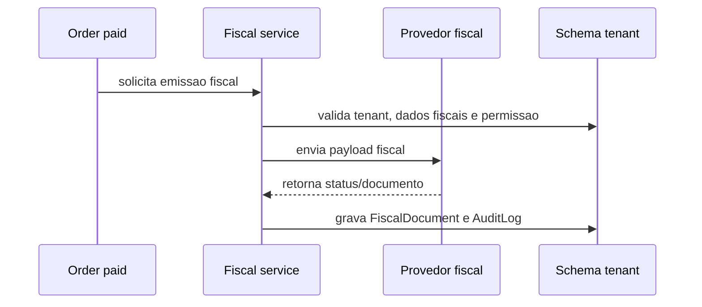

# Arquitetura Fiscal Futura

Fiscal permanece fora do MVP, mas a arquitetura deve deixar espaco para evoluir sem reescrever pedidos e pagamentos.

## Escopo Futuro

- nota fiscal;
- CPF;
- CNPJ;
- inscricao estadual;
- inscricao municipal, se aplicavel;
- documentos fiscais;
- integracao com provedor fiscal;
- cancelamento/inutilizacao fiscal;
- eventos fiscais;
- armazenamento seguro de XML/PDF;
- auditoria.

## Fora do MVP

Nao implementar no primeiro MVP:

- emissao automatica de nota fiscal;
- integracao fiscal em tempo real;
- validacao tributaria complexa;
- calculo de impostos por UF;
- SPED ou obrigacoes fiscais avancadas.

## Preparacao Arquitetural

Mesmo fora do MVP:

- pedidos devem preservar dados necessarios para futura emissao;
- dados fiscais devem ser tenant-scoped;
- documentos fiscais devem ser anexos protegidos;
- integracoes fiscais devem usar credenciais do tenant quando aplicavel;
- logs nao devem conter dados fiscais sensiveis sem necessidade;
- alteracoes fiscais exigem AuditLog.

## Modelos Futuros

Possiveis modelos no schema do tenant:

- `FiscalProfile`;
- `FiscalDocument`;
- `FiscalEvent`;
- `FiscalProviderConfig`;
- `TaxRuleSnapshot`.

## CPF, CNPJ e LGPD

Regras:

- coletar somente quando necessario;
- validar formato no backend;
- proteger em logs e exports;
- permitir retencao conforme obrigacao legal;
- diferenciar dado operacional de dado fiscal.

## Integracao Fiscal

Fluxo futuro:

## Riscos

- emitir documento fiscal com dados incorretos;
- expor CPF/CNPJ em log;
- misturar documentos fiscais entre tenants;
- cancelar pedido sem tratar documento fiscal emitido;
- reembolso sem reflexo fiscal futuro.

## Decisao

Fiscal fica fora do MVP, mas os fluxos de pedido, pagamento, cancelamento e reembolso devem preservar dados e eventos suficientes para integracao futura.
