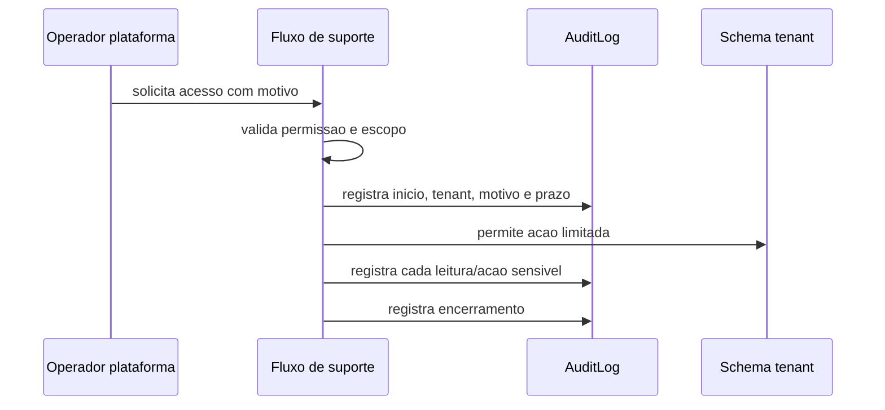

# Suporte da Plataforma

Este capitulo define como operadores da plataforma podem prestar suporte sem acesso irrestrito aos dados dos tenants.

## Principios

- menor privilegio;
- motivo obrigatorio;
- auditoria completa;
- rastreabilidade;
- acesso temporario;
- aprovacao quando necessario;
- logs com tenant, operador, usuario afetado, acao e resultado;
- nunca permitir acesso irrestrito aos dados dos tenants.

## Modelo Recomendado

Operador da plataforma nao deve entrar livremente no tenant.

Qualquer acesso de suporte a dados de tenant deve passar por fluxo explicito:



Modelo definitivo:

- suporte opera por ferramenta de plataforma, nao por login compartilhado do tenant;
- acesso exige tenant, escopo, motivo e prazo;
- acesso sensivel exige aprovacao;
- cada leitura/acao sensivel gera AuditLog;
- secrets de gateway, senhas, tokens e chaves privadas nao sao visiveis ao suporte;
- suporte nao altera estado financeiro sem permissao especifica e motivo;
- break-glass, se existir, deve ter fluxo proprio, aprovacao posterior e alerta.

## Acesso Temporario

Quando necessario:

- definir tenant;
- definir escopo;
- definir motivo;
- definir prazo;
- exigir aprovacao para escopos sensiveis;
- registrar inicio/fim;
- revogar automaticamente.

Escopos recomendados:

```text
read_order
read_customer_masked
read_logs
retry_webhook
view_public_config
```

Escopos proibidos por padrao:

```text
read_gateway_secret
change_payment_status
download_full_backup
cross_tenant_query
```

## Acoes Permitidas

Exemplos, sempre com permissao e auditoria:

- visualizar configuracao tecnica do tenant;
- auxiliar em problema de pedido especifico;
- consultar logs tecnicos filtrados;
- reenviar webhook/reconciliacao com escopo claro;
- orientar configuracao de pagamento sem visualizar segredo.

## Acoes Proibidas por Padrao

- listar todos os dados de todos os tenants;
- baixar backup de tenant sem procedimento formal;
- visualizar segredo de gateway;
- alterar pagamento sem permissao especifica;
- acessar dados pessoais sem motivo registrado;
- usar `is_superuser` como passe livre.
- consultar dados diretamente em todos os schemas sem escopo.
- manter acesso apos expiracao do prazo.

## Auditoria

Registrar:

- operador;
- tenant;
- motivo;
- ticket/referencia;
- escopo;
- IP;
- horario;
- objeto acessado;
- acao;
- resultado;
- aprovador, quando houver.

## Testes Obrigatorios

- operador sem escopo nao acessa dados de tenant.
- acesso de suporte exige motivo.
- acesso de suporte gera AuditLog.
- acesso expirado e negado.
- operador nao visualiza segredo de gateway.

## O Que Nao Fazer

- Nao criar backdoor de suporte.
- Nao compartilhar login do tenant.
- Nao usar senha mestre.
- Nao permitir impersonation sem auditoria e prazo.
- Nao transformar operador da plataforma em administrador de todos os tenants.
