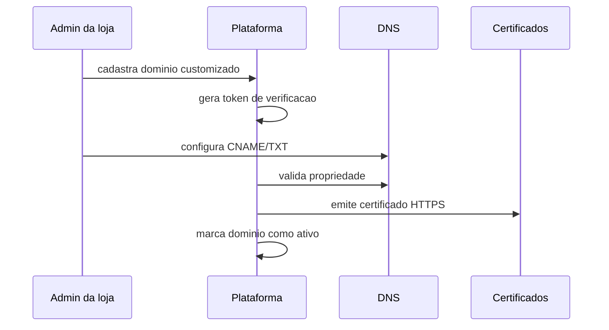

# Dominios e HTTPS

Este capitulo expande a arquitetura de dominios para tenants.

## Tipos de Dominio

### Dominio Principal

Exemplo:

```text
meusaas.com
```

Uso:

- landing page;
- cadastro de lojas;
- painel da plataforma;
- suporte;
- documentacao;
- operacao global.

### Subdominio da Plataforma

Exemplos:

```text
loja-a.meusaas.com
mercado-central.meusaas.com
```

Uso:

- loja/tenant;
- storefront;
- painel da loja;
- checkout;
- pedidos.

### Dominio Proprio do Cliente

Exemplos:

```text
www.lojadojoao.com.br
loja.marca.com
```

Uso futuro:

- storefront do tenant;
- checkout do tenant;
- SEO da marca.

## Multiplos Dominios por Tenant

Um tenant pode ter:

- subdominio padrao;
- dominio proprio principal;
- alias;
- dominio temporario para validacao.

Regras:

- cada dominio resolve para exatamente um tenant;
- dominio nao pode apontar para dois tenants;
- dominio precisa verificacao de propriedade;
- dominio principal/canonico deve ser definido;
- redirecionamentos devem preservar Host seguro e tenant correto.

## Dominio Canonico e Aliases

Cada tenant deve ter exatamente um dominio canonico ativo para storefront/login/checkout.

Aliases podem existir, mas devem redirecionar para o dominio canonico antes de login e checkout, salvo decisao especifica futura.

Motivos:

- reduzir confusao de sessao;
- evitar SEO duplicado;
- preservar cookies host-only;
- diminuir risco de tenant errado por alias;
- facilitar suporte e auditoria.

Exemplo:

```text
loja-a.meusaas.com -> loja-a.com.br
www.loja-a.com.br -> loja-a.com.br
```

O dominio canonico sempre resolve para um unico tenant.

## HTTPS e Certificados

Requisitos:

- HTTPS obrigatorio em producao;
- certificados renovados automaticamente quando possivel;
- alerta antes de expirar;
- dominio customizado so ativa apos certificado valido;
- fallback inseguro para HTTP nao deve ser permitido.

## Fluxo Seguro de Ativacao



## Riscos

- takeover de subdominio;
- dominio apontando para tenant errado;
- certificado expirado;
- cookie compartilhado indevido;
- SEO duplicado por alias sem canonico.

## Testes Obrigatorios

- dominio desconhecido retorna erro seguro.
- dominio customizado resolve tenant correto.
- alias nao troca tenant.
- tenant nao reivindica dominio ja usado.
- HTTPS invalido impede ativacao em producao.
