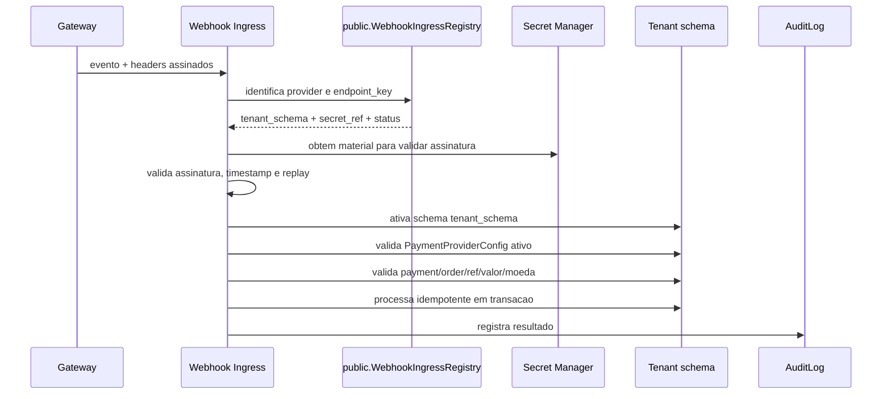

# Webhook Routing, Tenant Resolution e Secret Management

Este documento e a fonte canonica para webhooks de pagamento e gerenciamento de segredos de gateways.

## Problema

Webhooks chegam por fora da sessao do usuario e, muitas vezes, sem `Host` de tenant confiavel.

Ao mesmo tempo, a assinatura do webhook pode depender de um segredo do provider que pertence ao tenant.

Ambiguidade perigosa:

- validar assinatura antes de resolver tenant exige conhecer o segredo;
- resolver tenant antes de validar assinatura pode confiar em payload nao autenticado;
- guardar segredos dentro do tenant dificulta validar eventos no ponto de entrada;
- endpoint por tenant pode simplificar roteamento, mas aumenta superficie de configuracao e risco operacional.

## Decisao Canonica

Usar um `WebhookIngressRegistry` no schema `public` com dados minimos para roteamento seguro.

O registry nao armazena segredo em texto puro.

Ele contem apenas metadados suficientes para:

- identificar provider;
- resolver tenant/schema;
- localizar credencial protegida;
- validar endpoint ativo;
- aplicar rate limit;
- registrar auditoria inicial.

Segredos de gateway devem ficar em secret manager ou em armazenamento com envelope encryption.

## Alternativas Consideradas

### Endpoint Unico sem Registry

O endpoint recebe evento e tenta descobrir tenant pelo payload.

Vantagem:

- simples.

Desvantagens:

- payload ainda nao e confiavel;
- aumenta risco de tenant spoofing;
- dificulta validar assinatura por segredo de tenant.

Nao recomendado.

### Endpoint por Tenant e Provider

Exemplo:

```text
/webhooks/{tenant_slug}/{provider}/
```

Vantagens:

- roteamento claro;
- facil configurar em alguns gateways.

Desvantagens:

- tenant aparece na URL;
- erro de configuracao pode apontar webhook para tenant errado;
- ainda precisa validar assinatura e provider;
- dificulta dominios customizados e rotacao.

Pode existir no futuro, mas nao como estrategia principal sem registry.

### Metadata Assinada Enviada ao Gateway

O backend envia metadata opaca/assinada ao criar pagamento.

Vantagens:

- ajuda a localizar tenant e pedido;
- reduz dependencia de payload livre.

Desvantagens:

- nem todo gateway preserva metadata;
- metadata pode nao vir em todos os eventos;
- ainda precisa validar assinatura do provider.

Recomendada como complemento, nao como unica fonte.

### WebhookIngressRegistry no `public`

Vantagens:

- roteamento inicial fica fora de payload nao confiavel;
- permite validar provider/endpoint antes de entrar no tenant;
- suporta dominios customizados;
- facilita rotacao e desativacao de credenciais;
- reduz ambiguidade entre assinatura e tenant.

Desvantagens:

- mais uma tabela de plataforma;
- exige cuidado para nao guardar segredo exposto no `public`;
- exige reconciliacao entre registry e configuracao do tenant.

Recomendada.

## Modelo Conceitual

Schema `public`:

```text
WebhookIngressRegistry
- id
- provider
- endpoint_key
- tenant_schema
- provider_account_ref
- secret_ref
- environment
- status
- created_at
- rotated_at
```

Schema do tenant:

```text
PaymentProviderConfig
- provider
- environment
- public_config
- secret_ref
- enabled_methods
- status
- audit fields
```

O `secret_ref` aponta para secret manager ou material criptografado. Ele nao e o segredo em texto puro.

## Fluxo Seguro



## Regras de Seguranca

- Nunca confiar em tenant vindo do payload.
- Nunca resolver tenant por header customizado enviado pelo frontend.
- Nunca guardar segredo em texto puro.
- Nunca logar segredo, assinatura bruta sensivel ou payload de cartao.
- Webhook invalido deve retornar resposta segura e auditavel.
- Evento duplicado deve ser idempotente.
- Evento conflitante deve ir para revisao.
- Tenant/schema usado no processamento deve vir do registry validado.
- `PaymentProviderConfig` do tenant precisa estar ativo e coerente com o registry.
- Rotacao de segredo deve atualizar registry e config do tenant com auditoria.

## Estados de Entrada

`WebhookIngressRegistry.status`:

```text
active
disabled
rotating
revoked
test
```

Eventos para registry inativo devem ser rejeitados ou aceitos sem efeito, conforme provider, sempre com auditoria.

## Auditoria

Registrar no minimo:

- provider;
- endpoint_key;
- tenant_schema;
- event_id;
- status da validacao;
- motivo de rejeicao;
- request_id;
- ip/origem quando disponivel;
- timestamp;
- resultado final.

## Anti-Padroes

- Validar assinatura com segredo buscado por tenant informado no payload.
- Usar uma unica credencial global para todos os tenants sem desenho explicito.
- Armazenar access token de gateway em campo visivel no admin/API.
- Processar webhook no schema `public` para dados operacionais.
- Aceitar webhook apenas porque o `payment_id` existe.
