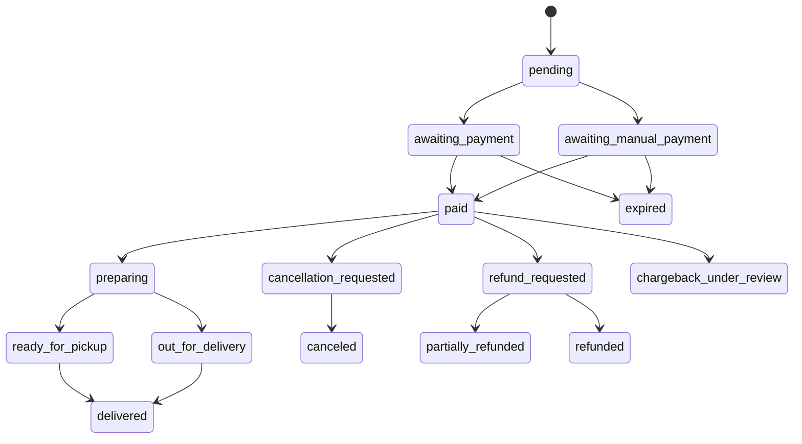
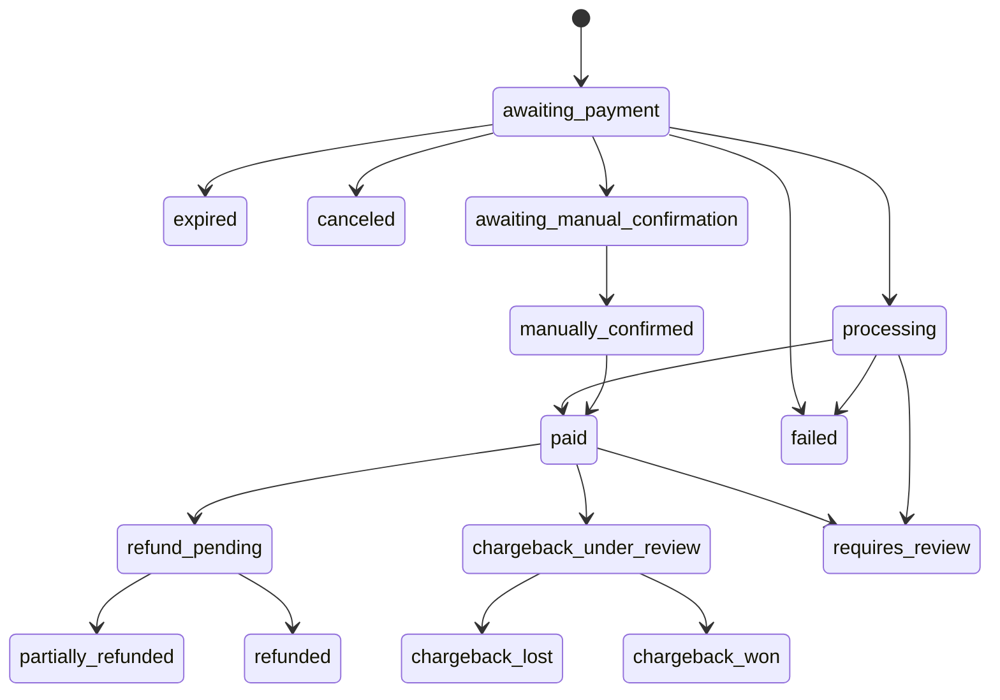
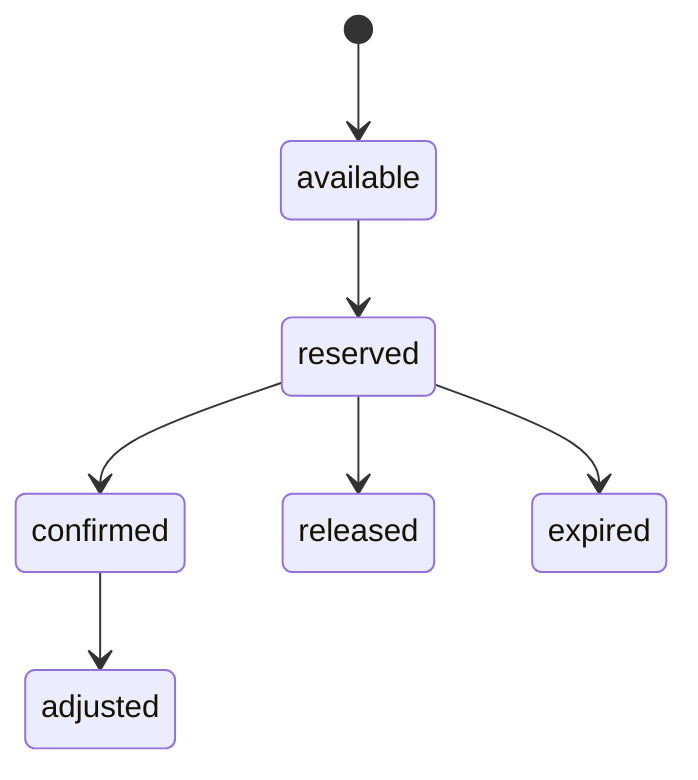

# State Machines Canonicas

Este documento e a fonte canonica para estados de `Order`, `Payment`, `Refund`, `Chargeback` e estoque.

Outros documentos podem mostrar fluxos simplificados, mas em caso de divergencia este documento prevalece.

## Principios

- Estados mudam apenas por services backend.
- Transicoes sensiveis geram AuditLog.
- Webhooks e jobs devem ser idempotentes.
- Transicoes conflitantes geram revisao.
- Status externo de gateway nao substitui status interno.
- Estados vivem no schema do tenant.

## Order

Estados canonicos:

```text
draft
pending
awaiting_payment
awaiting_manual_payment
paid
preparing
ready_for_pickup
out_for_delivery
delivered
cancellation_requested
canceled
refund_requested
partially_refunded
refunded
chargeback_under_review
expired
failed
```

Transicoes principais:



Regras:

- `paid` so acontece por webhook valido, conciliacao confiavel ou confirmacao manual auditada.
- `delivered` nao volta para `pending`.
- `canceled` nao volta para `paid` sem reabertura auditada.
- cancelamento apos pagamento passa por reembolso ou decisao auditada.

## Payment

Estados canonicos:

```text
awaiting_payment
processing
paid
failed
canceled
expired
awaiting_manual_confirmation
manually_confirmed
refund_pending
partially_refunded
refunded
chargeback
chargeback_under_review
chargeback_lost
chargeback_won
requires_review
```

Transicoes principais:



Regras:

- `manually_confirmed` e evidencia operacional; `paid` e estado financeiro final interno.
- `failed -> paid` exige nova tentativa ou evento confiavel auditado.
- `paid -> failed` nao ocorre por evento tardio; deve gerar `requires_review`.
- reembolso nao remove pagamento original.

## Refund

Estados canonicos:

```text
requested
approved
processing
succeeded
failed
canceled
requires_review
```

Regras:

- soma de refunds bem-sucedidos nao pode exceder valor pago.
- refund parcial deve indicar item/valor/motivo quando aplicavel.
- refund automatico e manual compartilham a mesma trilha de auditoria.

## Chargeback

Estados canonicos:

```text
received
under_review
evidence_required
evidence_submitted
won
lost
accepted
reversed
closed
```

Regras:

- chargeback nao e cancelamento simples.
- chargeback pode bloquear reembolso duplicado.
- evidencias/anexos sao tenant-scoped e privados.
- resultado final impacta relatorios financeiros.

## Estoque

Estados canonicos de reserva:

```text
available
reserved
confirmed
released
expired
adjusted
```

Transicoes:



Regras:

- reserva deve ter expiracao.
- confirmacao e idempotente.
- webhook duplicado nao confirma duas vezes.
- cancelamento antes do pagamento libera reserva.
- ajuste manual exige motivo e AuditLog.

## Transicoes Proibidas

- pedido cancelado virar pago sem service de reabertura auditada.
- pagamento pago virar falho por evento tardio.
- refund exceder saldo pago.
- chargeback encerrado ser alterado sem nova evidencia/evento.
- reserva expirada ser confirmada sem revisao.

## Responsabilidade

Cada dominio pode ter services especificos, mas a validacao de transicao deve ser centralizada ou reutilizavel.

O frontend nunca decide estado financeiro ou operacional final.
